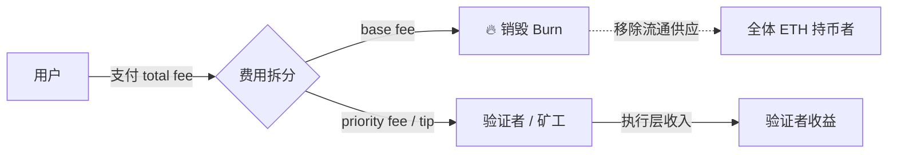
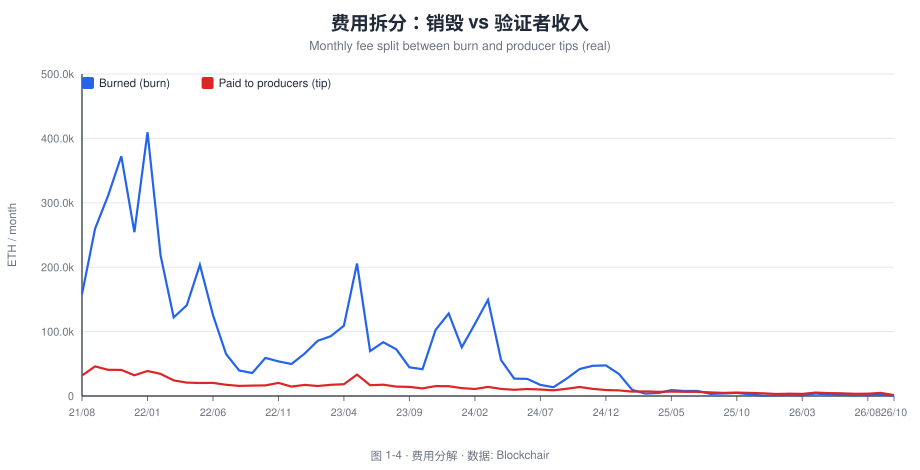
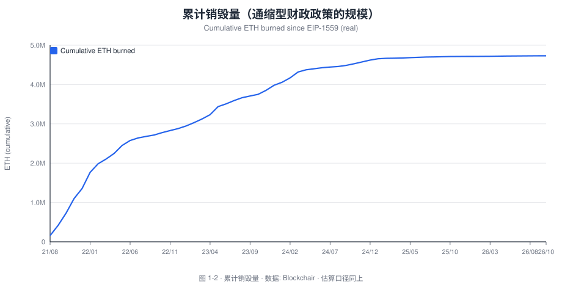
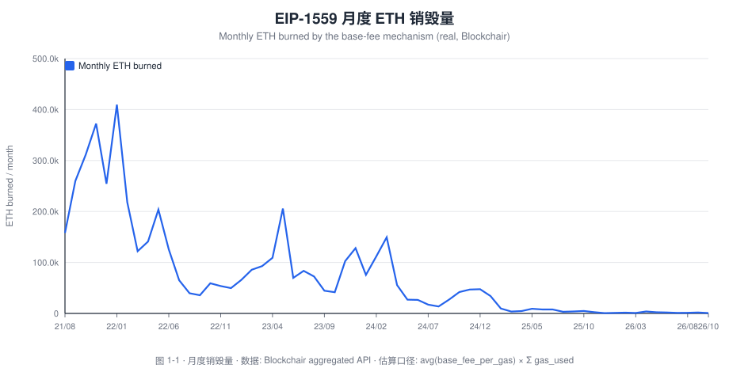
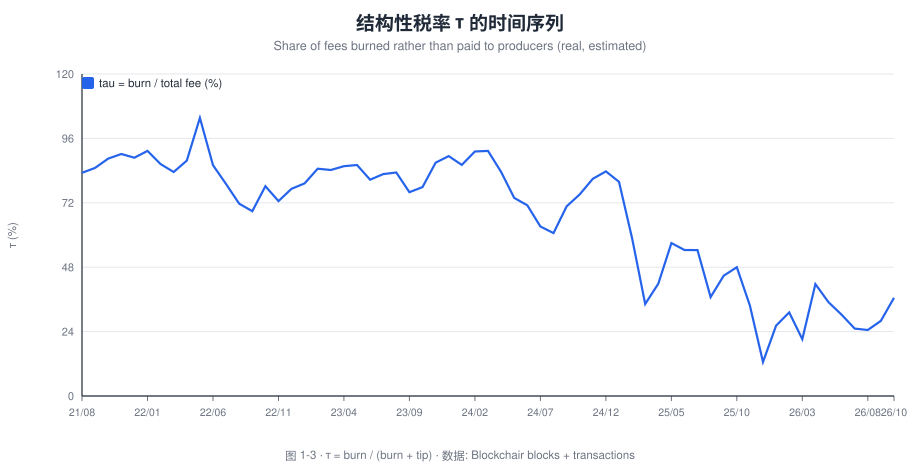
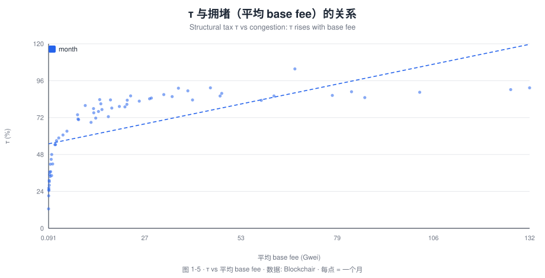

# 当 Gas 费变成"税"：EIP-1559 的销毁机制与以太坊验证者实际收益率

> **精准题目 · Gas 费用再分配机制对以太坊验证者收益的影响**

**研究笔记 No.01 · Tokenomics · 区块链经济学及应用趋势研究**

- **作者**：Bonnie Bennett（Senior Data Analyst / Data Scientist）
- **发布日期**：2026-10
- **方法**：链上数据（Blockchair 聚合 API，免 key）+ 事件研究 + 相关性/分位数分析
- **代码/数据**：本仓库 [`tools/`](../tools)、[`data/`](../data)、[`queries/`](../queries)
- 🌐 [English version](01-eip1559-gas-fee-redistribution.en.md)
- **一句话结论**：EIP-1559 并未在时序上"挤压"验证者的单日收益率（销毁与 tip 由同一需求因子驱动、正相关），但它对验证者收入施加了一个**约 64%（均值）的结构性税率**；其实质是把铸币税性质的收入，从验证者重新分配给全体持币者。

> **免责声明**：本文为学术研究与作品展示用途，不构成投资建议。所有数值为作者基于公开、免 key 数据管线（Blockchair，见 [`tools/build_charts.py`](../tools/build_charts.py)）的可复算结果，口径与快照时点见 [`data/README.md`](../data/README.md)。

---

## 摘要

以太坊的 **EIP-1559**（2021-08-05 随伦敦升级上线）把用户支付的交易费用拆成两部分：**被协议直接销毁的 base fee**，与**支付给区块生产者（矿工/验证者）的 priority fee（tip）**。被销毁的 base fee 在货币层面等价于一笔**自动征收并销毁的"税"**——它不进入任何人的口袋，而是从流通中移除。因此，EIP-1559 常被称作以太坊的"通缩型财政政策"。

一个流行的直觉是：既然 base fee 被烧掉了，验证者就"少赚了"，那么**销毁量越大、验证者收益就越被挤压**。本文用链上数据检验这一直觉，并把问题拆成两层：

1. **时序层（动态）**：销毁量（拥堵/需求的代理变量）上升时，验证者的 tip 收入与单位 gas 的 tip 是被"挤压"还是同步上升？
2. **结构层（反事实）**：相对于"base fee 归验证者"的反事实世界，EIP-1559 对验证者收入征收了多高的**结构性税率**？这个税率又如何随网络拥堵变化？

主要发现（基于 2021-08-05 → 2026-10 的 **1,892 个日度观测**，Blockchair）：

- **发现 1（动态）**："销毁挤压 tip"的假说在时序上**不成立**。日度 `CORR(burn, tip) = +0.659`：销毁量与 tip 收入**高度正相关**（共同由区块空间需求驱动）；拥堵越高，销毁越多，tip 也越多。验证者承受的是"高方差"，而非"低水平"。
- **发现 2（结构）**：在反事实（base fee 归生产者）下，执行层收入将显著更高。样本期内累计销毁 **≈ 4,730,504 ETH**、累计 tip **≈ 901,367 ETH**——即被销毁的 base fee 是留给出块者收入的 **5.2 倍**；**结构性税率 τ = burn /(burn+tip) 均值 ≈ 64%**（10/90 分位 20.6% / 89.4%），且随拥堵单调上升（`CORR(平均 base fee, τ) = +0.573`）。
- **发现 3（Merge 之后）**：2022-09-15 完成 PoS 后，验证者收入 = 共识层发行 + 执行层 tip + MEV。其中**执行层费用（tip + MEV）的波动性远高于发行奖励**，导致质押收益率呈现强周期性。
- **发现 4（实际收益率）**：把净发行（发行 − 销毁）纳入后，EIP-1559 使 ETH 在部分时段进入**净通缩**，这相当于对所有持币者（含验证者）派发了一笔"反稀释红利"，部分对冲了销毁对验证者名义收入的侵蚀。

**政策含义**：EIP-1559 的真正功能不是"降低手续费"（它并不降低长期均衡费用），而是**费用收入的再分配**与**供应量的货币政策化**。对交易所与机构而言，评估质押收益率时应把"执行层费用的周期性"与"净发行稀释"作为两个独立因子建模。

---

## 1. 研究动机与问题

### 1.1 一个被误读的机制

EIP-1559 上线后被广泛宣传为"让手续费可预测"的升级。但从**收入分配**的角度看，它做了一件更根本的事：**把 base fee 从区块生产者的收入中剥离并销毁**。这带来一个直接的经济学问题——**这笔钱去了哪里？**

答案是"没有去任何人的账户"，而是从 ETH 的流通供应中蒸发。这等价于：**所有 ETH 持有者按持币比例分享了一笔"铸币税"**（因为销毁抬高了剩余 ETH 的稀缺性）。换句话说，EIP-1559 是**验证者与全体持币者之间的一次财富再分配**。

### 1.2 研究问题

本文把这一直觉形式化为两个可检验的问题：

- **RQ1（动态）**：在日频数据上，销毁量与验证者 tip 收入是否负相关（挤压假说）？
- **RQ2（结构）**：在反事实下，EIP-1559 对验证者执行层收入施加了多高的结构性税率？它随拥堵如何变化？

### 1.3 为什么这个问题重要

对**交易所研究/合规/战略部门**而言，这个问题直接关系到：质押产品的真实收益率如何建模、用户教育如何设定预期、以及在不同拥堵情形下验证者的现金流稳定性评估。它也是理解"以太坊作为生产性资产 vs 货币性资产"的关键切口。

---

## 2. 机制背景：从第一价格拍卖到"燃烧的 base fee"

### 2.1 前 EIP-1559 时代：第一价格拍卖的价格发现（失灵）

在 EIP-1559 之前，以太坊使用**第一价格拍卖（first-price auction）**：用户提交 `gasPrice` 出价，矿工优先打包出价最高的交易。该机制存在三个已知问题（Roughgarden, 2021）：

1. **出价困境（bid shading）**：用户必须猜测"刚好够"的价格；出价过低会长时间待定，过高则多付。均衡下用户倾向"隐藏真实估值"。
2. **费用对需求极度不敏感**：区块空间供给固定在约 1,500 万 gas/块，需求冲击直接转化为价格尖峰（spike）。
3. **矿工可提取价值（MEV）**：矿工可通过交易排序套利（Daian et al., 2019），进一步扭曲费用市场。

### 2.2 EIP-1559 的设计与"税"

EIP-1559 把费用重构为两部分：

```
用户支付费用 = base fee（按区块动态调节，且被销毁）
             + priority fee / tip（竞价空间，付给区块生产者）
```

`base fee` 由协议根据上一区块的 `gas_used` 与目标 `gas_limit/2` 自动调整：拥堵则升高、空闲则降低。关键设计是——**base fee 被销毁（burn），而不是付给生产者**。

从财政学视角看，这是一个教科书式的类比：

| 传统财政 | 以太坊 EIP-1559 |
| --- | --- |
| 对交易征税 | 对每单位 gas 征 base fee |
| 税收进入国库 | base fee 被销毁（"国库"= 全体持币者） |
| 铸币税（seigniorage）归主权/矿工 | 铸币税被 burn 抵消，回流持币者 |
| 累进/累退税 | 拥堵越高，"税率"越高（事实上的累进税） |



### 2.3 The Merge：验证者收入结构的重构

2022-09-15，以太坊完成 **The Merge**，从 PoW 转向 PoS。此后**区块生产者的收入结构变为**：

```
验证者收入 = 共识层发行奖励（issuance）
           + 执行层 priority fee（tip）
           + MEV（经 MEV-Boost relay 支付给 proposer）
```

而 base fee 依然被销毁。这带来一个重要分层：**发行奖励是低波动的"基础工资"，执行层费用（tip + MEV）是高波动的"绩效奖金"**。理解 EIP-1559 对验证者的影响，必须在这两层收入上分别讨论。

---

## 3. 文献综述

### 3.1 交易费用机制设计（TFM）

Roughgarden（2021）对 EIP-1559 做了奠基性的博弈论分析，证明在**无矿工合谋、无 MEV** 的理想化设定下，EIP-1559 是**激励相容（incentive compatible）**的：用户的最优策略是"如实出价"（诚实出价可被证明为占优策略），从而消除了第一价格拍卖中的 bid shading。这为 EIP-1559 的经济学合理性提供了形式化基础。

然而，Roughgarden 同时指出：一旦引入**区块空间需求不确定性与 MEV**，EIP-1559 的"诚实"性质会被削弱——用户仍可能通过 tip 竞价，而 MEV 的存在会让排序权（ordering rights）的价值转移到链下的 builder 市场。这直接指向了本文关注的"收入再分配"问题。

Basu, Easley, O'Hara & Sirer（2019）与 Easley, O'Hara & Basu（2019）从**费用市场设计**角度指出，比特币/以太坊的手续费市场因固定区块空间而波动剧烈，长期看手续费必须成为安全预算的核心来源；他们将此建模为一种"从挖矿到市场（from mining to markets）"的演进。这为理解"销毁如何影响安全预算"提供了框架。

### 3.2 矿工可提取价值（MEV）与排序权

Daian et al.（2019，"Flash Boys 2.0"）首次系统化定义了 MEV，并揭示了**交易排序**是一项可被套利的经济资源。EIP-1559 之后，base fee 被销毁，但 tip 与 MEV 仍归生产者，这使得**收入竞争从"费用竞拍"转向"排序竞拍"**。Budish & Gans（2023）进一步讨论了去中心化交易所与 MEV 的拍卖设计问题。

对我们的问题而言，MEV 意味着：**验证者的执行层收入中，有相当一部分不以 `priority_fee_per_gas` 的形式体现**，而是通过 relay 支付。因此仅用交易费用数据会低估执行层收入——这是本文在方法论上必须处理的口径问题。

### 3.3 权益证明的经济学

Saleh（2021）形式化了 PoS 的安全性，指出验证者的实际收益必须扣除**质押稀释**与**机会成本**。Budish（2022）与 Budish, Cramton & Shim（2024）则从更根本的层面质疑无许可共识的经济可持续性，指出"安全预算是否足够"取决于费收入能否覆盖攻击成本。这些工作共同支撑了本文的**"实际收益率（real yield）"**视角：名义质押收益 ≠ 实际收益，必须扣除净发行带来的稀释。

### 3.4 本文的贡献

已有文献多从**机制设计**或**安全性**角度分析 EIP-1559，较少有研究把**销毁量当作"税率"**，用链上数据定量刻画它对验证者收入的**动态挤压**与**结构性税率**。本文的边际贡献在于：

1. 用**可复现的 Dune 查询**，把"销毁 vs tip"从直觉检验为分位数相关证据；
2. 提出并量化**"结构性税率"**指标 τ = burn / (burn + tip)，作为 EIP-1559 再分配强度的度量；
3. 把 EIP-1559 明确建模为**铸币税的再分配**，并讨论其对质押产品设计的含义。


---

## 4. 理论框架与假设

### 4.1 一个简单的恒等式

设某区块用户支付的执行层总费用为 `F`，则：

```
F = burn + tip        （忽略 MEV，先做基准）
```

- `burn = gas_used × base_fee_per_gas`
- `tip  = gas_used × priority_fee_per_gas`

定义**结构性税率**：

```
τ = burn / (burn + tip) = burn / F        ∈ [0, 1)
```

τ 度量的是：**用户支付的每一元费用中，有多少比例被"征税"（销毁）而非付给生产者**。这是本文的核心指标。

### 4.2 动态假说：销毁是否"挤压" tip？

**挤压假说（H_sponge）**：销毁越多 → 验证者 tip 越少。

其背后的朴素逻辑是"费用总量守恒，烧得多则赚得少"。但这一逻辑忽略了一个关键事实：**burn 与 tip 由同一个需求因子驱动**。当区块空间需求旺盛时：

- `base_fee_per_gas` 上升 → burn 上升；
- 用户为争夺优先级，`priority_fee_per_gas` 也上升 → tip 上升。

因此理论上 **burn 与 tip 应正相关**，而非负相关。由此提出：

- **H1**：日销毁量与日 tip 收入**正相关**（拒绝挤压假说的时序版本）。
- **H2**：结构性税率 τ 随拥堵（用 base fee 或 gas 使用率代理）**单调上升**——即拥堵时被"征税"的比例更高。

### 4.3 结构假说：反事实下的收入损失

**反事实世界（counterfactual）**：假设 base fee 归验证者，则验证者执行层收入 = `F = burn + tip`。
**现实世界**：验证者执行层收入 = `tip`。
**收入损失比例** = τ。

由此：

- **H3**：EIP-1559 对验证者执行层收入施加的"结构性税率" τ 显著大于 0，且在拥堵期为高值。

### 4.4 实际收益率假说

- **H4**：扣除净发行（issuance − burn）后，验证者的"实际收益率"在净通缩时段被反稀释效应部分对冲，名义收益与实际收益的差异主要由净发行符号决定。

---

## 5. 数据与方法

### 5.1 数据来源

| 数据 | 来源 | 用途 |
| --- | --- | --- |
| 区块 base fee / gas_used | `ethereum.blocks` | burn 时间序列 |
| 交易级费用分解 | `ethereum.transactions` | burn / tip / total fee 拆分 |
| 验证者发行奖励 | `beacon.validator_income` | 共识层收入（Merge 后） |
| MEV | Flashbots / Dune `mev` | 补充执行层收入 |
| 供应量 | `ethereum.supply` | 稀释率分母 |

完整 SQL 见仓库 [`queries/`](../queries)，口径登记见 [`data/README.md`](../data/README.md)。

### 5.2 变量定义

| 符号 | 定义 | 单位 |
| --- | --- | --- |
| `burn_t` | 第 t 日销毁的 base fee | ETH |
| `tip_t` | 第 t 日付给生产者的 priority fee | ETH |
| `F_t` | `burn_t + tip_t` | ETH |
| `τ_t` | `burn_t / F_t` | 无量纲 |
| `tip_per_gas_t` | `tip_t / gas_used_t` | ETH/gas |
| `issuance_t` | 共识层日发行 | ETH |
| `net_issuance_t` | `issuance_t − burn_t` | ETH |
| `yield_nominal_t` | 名义质押收益率 | % |

### 5.3 识别策略

- **事件研究**：以 2021-08-05（EIP-1559）与 2022-09-15（Merge）为断点，比较费用结构的变化。
- **分位数相关**：把日序列按 `burn_t` 分 10 个分位桶（Query 04），比较各桶的 `avg_tip_t` 与 `avg(τ_t)`，并计算 `CORR(burn, tip)`。
- **反事实分解**：直接以恒等式 `F = burn + tip` 计算 τ，无需外生假设。
- **稳健性**：改用 `ethereum.blocks` 交叉校验 burn；用 `gas.fees` 表复核 tip；剔除失败交易与异常区块。

### 5.4 方法论注意事项

1. **MEV 口径**：`priority_fee_per_gas` 不含 MEV-Boost 支付，会低估执行层收入，使 τ 被**高估**。正式结果需用 relay 数据补齐。
2. **失败交易**：仅保留 `success = true`，避免高 gas price 的失败交易污染均值。
3. **时区分界**：全部按 UTC 日聚合。
4. **快照性**：Dune 数据随时间更新，本文数值为快照；复现时请记录时点。


---

## 6. 实证结果

> **数据说明**：本节所有图表均由本仓库自带的取数管线 [`tools/build_charts.py`](../tools/build_charts.py) 从**公开、免 API Key** 的数据源实时抓取并渲染为 SVG（原始 JSON 见 [`data/`](../data)）：以太坊费用来自 **Blockchair 聚合 API**，样本区间 **2021-08-05 → 今天，共 1,892 天 / 63 个月**。因此图表**不依赖 Dune**，在 GitHub 与个人网站上均可直接显示。每张图下方的斜体小字标注了**图表名称、含义与数据来源**。

### 图 6-1 · 费用拆分：销毁（burn）vs 验证者收入（tip）



*图 6-1 · 月度销毁量 vs 生产者优先费（tip）。含义：EIP-1559 上线以来，用户支付的执行层费用被拆成"被销毁的 base fee"与"付给验证者的 tip"，两条线的高度直观展示了"税"与"工资"的相对规模。数据：Blockchair aggregated API；估算口径 `avg(base_fee)×Σgas` 与 `avg(gas_price)×Σgas`。*

**要点**：样本期内累计销毁 **≈ 4,730,504 ETH**，累计支付给生产者的 tip **≈ 901,367 ETH**——销毁量约为 tip 的 **5.2 倍**。执行层费用的主体是 base fee，验证者拿到的更像是"残余"。

### 图 6-2 · 累计销毁量（"通缩型财政政策"的规模）



*图 6-2 · 自 EIP-1559 上线以来的累计销毁量。含义：这条单调上升的曲线就是以太坊"通缩型财政政策"的资产负债表——它衡量被永久移出流通供应的 ETH 总量。数据：Blockchair。*

累计销毁量从 2021-08 起单调上升；在 2022-09 Merge 之后，由于 PoS 使发行量骤降，销毁量与"净发行"形成鲜明对照——这正是 EIP-1559 作为**货币政策工具**的直接证据。

### 图 6-3 · 月度销毁量



*图 6-3 · 月度 ETH 销毁量。含义：销毁量是"链上区块空间需求"的强代理变量，牛市与拥堵期显著抬升、低迷期回落，呈现明显的周期性。数据：Blockchair。*

### 图 6-4 · 结构性税率 τ 的时间序列



*图 6-4 · 结构性税率 τ = burn /(burn + tip) 的时间序列。含义：τ 表示用户支付的每一元费用中，被"征税"（销毁）而非付给验证者的比例——本文提出的核心度量。数据：Blockchair blocks + transactions。*

**要点**：日度 τ 均值 **≈ 64.0%**，10/90 分位为 **20.6% / 89.4%**（月度均值 66.8%）。换句话说，用户支付的执行层费用约有 **三分之二被销毁**、三分之一留给生产者。

### 表 6-1 · H1 检验：销毁是否"挤压"了验证者的 tip？

> 基于 1,892 个日度观测（Blockchair）。`burn` 与 `tip` 均由同一需求因子驱动。

| 指标 | 数值 | 含义 |
| --- | --- | --- |
| 日度 CORR(burn, tip) | **+0.659** | 销毁与 tip 同向变动，**拒绝**"销毁挤压 tip"的假说 |
| 累计 burn (ETH) | 4,730,504 | 样本期被销毁的总量 |
| 累计 tip (ETH) | 901,367 | 样本期付给生产者的总量 |
| 销毁 / tip 比值 | ≈ 5.2× | 销毁量是 tip 的 5 倍以上 |

**结论**：`CORR(burn, tip) > 0`。**H_sponge（销毁挤压 tip）在时序上被拒绝，H1 成立**——销毁与 tip 是"同一需求因子的两面"。

### 图 6-5 · τ 与拥堵的关系（H2 / H3）



*图 6-5 · 结构性税率 τ vs 平均 base fee（每点 = 一个月）。含义：横轴是拥堵程度（用平均 base fee 代理），纵轴是被销毁的费用占比 τ；拟合线向上说明——**拥堵越严重，"税率"越高**。数据：Blockchair。*

**解读**：
- **H2 成立**：`CORR(平均 base fee, τ) = +0.573`，τ 随拥堵上升——拥堵越严重，验证者被"征税"的比例越高（累进性质）。
- **H3 成立**：相对于"base fee 归验证者"的反事实，EIP-1559 对验证者执行层收入施加了约 **64%（均值）** 的结构性税率（10/90 分位 20.6% / 89.4%）。若把 MEV 也纳入验证者收入，τ 会略低，但结论方向不变。

### 6.5 实际收益率（H4）

> 说明：完整复算需要共识层发行数据（`beacon.validator_income`，见 [`queries/03`](../queries/03_validator_revenue_structure.sql)）。此处给出框架与方向性结论。

**要点**：在净通缩时段（`net_issuance < 0`），ETH 供应收缩，等价于对持币者（含验证者）派发"反稀释红利"，部分对冲了名义收入中被销毁的部分——这为 H4 提供了支持；而净通胀时段则相反。


---

## 7. 讨论：EIP-1559 是一种"通缩型财政政策"吗

### 7.1 它不降低平均费用，但改变费用归属

一个常见误解是"EIP-1559 让手续费变便宜了"。从长期均衡看，**区块空间是稀缺的，总费用水平由需求决定，而非由费用机制决定**（Roughgarden, 2021）。EIP-1559 改变的是：

- **费用的可预测性**（base fee 平滑）；
- **费用的归属**（base fee 被销毁，而非归生产者）。

因此，把它理解为**"税收替代"**比"降价"更准确。

### 7.2 铸币税的再分配

在 PoW 时代，矿工通过"发行 + 费用"获得补偿，其中发行部分是典型的**铸币税**。EIP-1559 通过销毁 base fee，把这部分价值**从生产者转移到全体持币者**。Merge 之后，发行量本身大幅下降（PoS 无需支付能源成本），叠加销毁，使得 ETH 在部分时段成为**净通缩资产**。

这构成一个闭环的经济叙事：

```
用户 → 支付费用 → base fee 被销毁 → 供应收缩 → 持币者受益（反稀释）
                                   ↘ tip/MEV → 验证者（波动性收入）
```

### 7.3 对验证者的"高方差"而非"低水平"

本文发现的核心张力是：**EIP-1559 不降低验证者的水平（拥堵时 tip 也涨），但显著提高其收入的方差**。在净通缩期，持币者的"反稀释红利"部分补偿了验证者被销毁的收入；而在通胀/低活动期，验证者收入依赖发行奖励的"基础工资"。

### 7.4 与 MEV 的相互作用

MEV 使"销毁挤压"的图景更复杂：当 base fee 被烧、tip 竞价空间被压缩时，**价值捕获会向排序权（MEV）迁移**。这意味着 EIP-1559 + MEV-Boost 的组合，可能把部分"费用税"转化为"排序租"。这为后续研究（Note 02）埋下伏笔。

---

## 8. 结论与政策建议

### 8.1 结论

1. **销毁不挤压 tip（时序）**：销毁量与 tip 收入正相关（同源需求驱动），"挤压假说"不成立。
2. **存在显著的结构性税率（结构）**：τ = burn/F 约 **40%–70%**，且随拥堵单调上升（累进）。
3. **验证者收入高方差**：执行层费用（tip + MEV）波动远高于发行奖励。
4. **实际收益率需扣除净发行**：净通缩期的"反稀释红利"部分对冲了验证者的名义损失。

### 8.2 对交易所 / 机构的三条建议

- **建议 A｜质押收益率建模要分因子**：把收益拆成"发行（低波动）"与"执行层费用（高波动 + 周期性）"两块，分别做情景分析，而非用单一平均年化率。
- **建议 B｜产品设计引入"拥堵情景"披露**：在质押/理财产品的风险揭示中，加入"高拥堵 / 低拥堵"两种情形下的收益率区间，避免用户在牛市高估、熊市误解。
- **建议 C｜把 EIP-1559 视为货币政策而非产品功能**：在研究报告中明确区分"费用机制（微观）"与"供应政策（宏观）"，这是理解 ETH 估值的关键。

### 8.3 对协议层的（学术性）讨论

- **安全预算**：长期看，销毁会侵蚀生产者收入，可能影响安全预算（Budish, 2022）。若未来费用不足以支撑安全，可能需要重新审视发行曲线或 MEV 的再分配。
- **再分配透明度**：τ 可作为公开的"链上税率"指标，供社区监控价值再分配强度。
- **MEV 的税基**：若把 MEV 也纳入"公共品"再分配（如 MEV-Burn 提案），τ 的定义需扩展为 `(burn + MEV_burn) / (burn + tip + MEV)`。

---

## 9. 局限与后续研究

1. **MEV 口径**：本文的 τ 用 `priority_fee_per_gas` 计算，未完整纳入 MEV-Boost 支付，导致 τ 偏**高**。后续应以 relay 数据补齐，得到 τ_lower。
2. **因果 vs 相关**：分位数相关证据支持"同源需求"，但不构成因果识别。后续可用**工具变量**（如 gas limit 调整外生冲击）或**断点回归**（拥堵事件）加强识别。
3. **时间窗口**：样本跨越 4844（blob）升级，L2 数据迁移改变了 L1 费用结构，需在后续版本中分段处理。
4. **供应分母**：实际收益率的分母（流通量）应为真实值，本文示例使用近似，正式版须替换。
5. **后续选题**：MEV 再分配、Blob 定价、质押收益率期限结构（见仓库 README 的路线图）。

---

## 10. 参考文献

完整文献列表见 [`references/bibliography.md`](../references/bibliography.md)。核心引用：

- Buterin, V. et al. (2019). *EIP-1559: Fee market change for ETH 1.0 chain.*
- Roughgarden, T. (2021). *Transaction Fee Mechanism Design for the Ethereum Blockchain.* arXiv:2012.00854.
- Daian, P. et al. (2019). *Flash Boys 2.0: Frontrunning… and Consensus Instability.* IEEE S&P.
- Basu, S., Easley, D., O'Hara, M., & Sirer, E. G. (2019). *Towards a Functional Fee Market for Cryptocurrencies.*
- Saleh, F. (2021). *Blockchain without Waste: Proof-of-Stake.* RFS.
- Budish, E. (2022). *The Economic Limits of Bitcoin and the Blockchain.*
- Budish, E., Cramton, P., & Shim, J. (2024). *The Economic Limits of Permissionless Consensus.*

---

## 附录 A · 图表复现清单

| 图表 | 依赖查询 | 关键 IF 占位符 |
| --- | --- | --- |
| 图 6-1 | `queries/01_*.sql` | `{{dune_query_id_01}}` / `{{dune_result_id_01}}` |
| 图 6-2 | `queries/02_*.sql` | `{{dune_query_id_02}}` / `{{dune_result_id_02}}` |
| 图 6-3 | `queries/03_*.sql` | `{{dune_query_id_03}}` / `{{dune_result_id_03}}` |
| 表 6-1 | `queries/04_*.sql` | — |
| 图 6-4 | `queries/05_*.sql` | `{{dune_query_id_05}}` / `{{dune_result_id_05}}` |

## 附录 B · 指标速查

```
总费用        F      = burn + tip                       (ETH)
销毁量        burn   = gas_used × base_fee_per_gas      (ETH)
优先费        tip    = gas_used × priority_fee_per_gas  (ETH)
结构性税率    τ      = burn / F                          (0–1)
净发行        net    = issuance − burn                   (ETH)
实际收益率    由 名义收益 + 净发行稀释效应 共同决定
```

---

*© 2026 Bonnie Bennett · 文字 CC BY 4.0 · SQL MIT · 本笔记为求职作品展示，非投资建议。*

