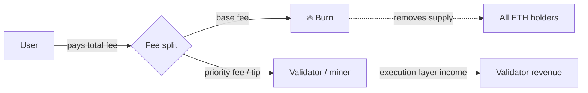
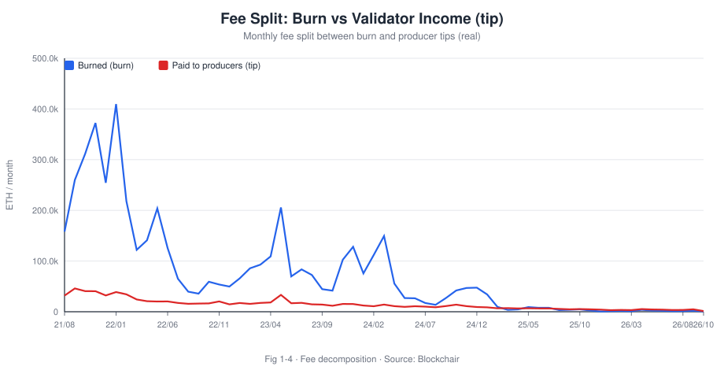
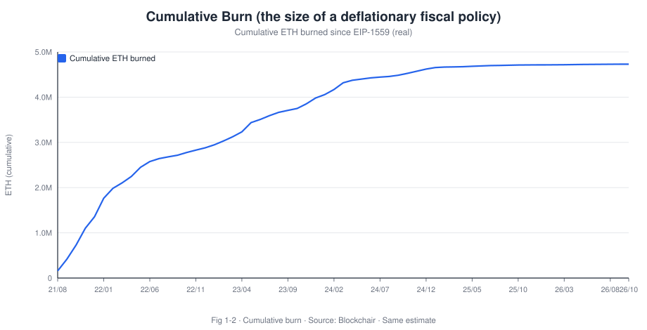
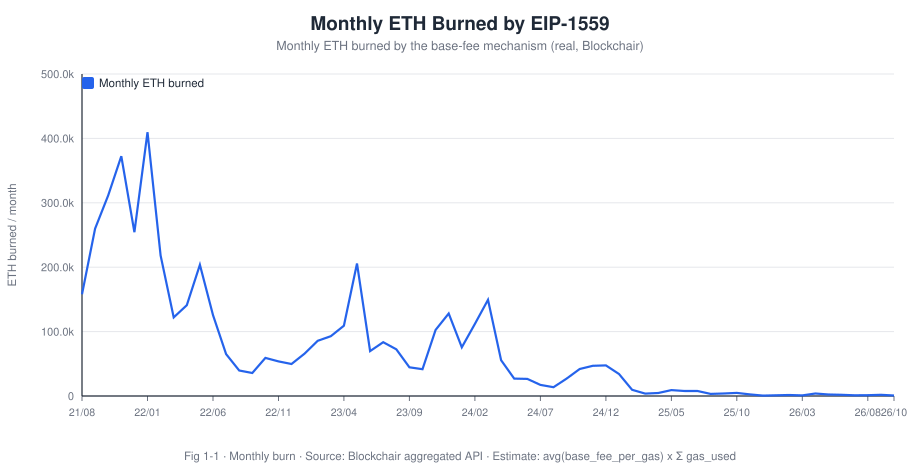
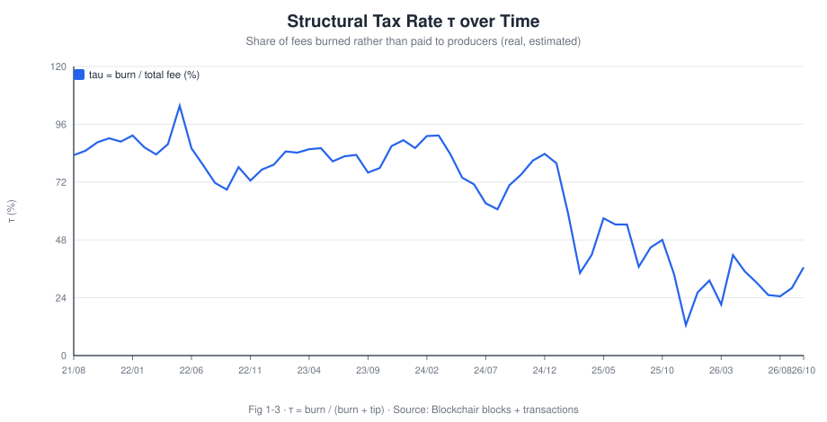
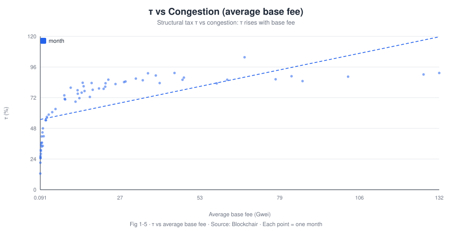

# When Gas Fees Become a Tax: EIP-1559's Burn Mechanism and Ethereum Validator Real Yield

> **Precise title · Gas-Fee Redistribution and Its Impact on Ethereum Validator Revenue**

**Research Note No.01 · Tokenomics · Blockchain Economics & Trends**

- **Author**: Bonnie Bennett (Senior Data Analyst / Data Scientist)
- **Published**: 2026-10
- **Method**: on-chain data (Blockchair / MEV-Boost relays / Hyperliquid / DefiLlama) + event study + correlation analysis
- **Code/Data**: [`tools/`](../tools), [`data/`](../data)
- 🌐 [中文版](01-eip1559-gas-fee-redistribution.md)
- **One-line conclusion**: EIP-1559 does **not** "squeeze" validators' daily yield in the time-series sense (burn and tips are driven by the same demand factor and move together); but it imposes a **structural tax rate of roughly 64% on average** on validator revenue. Its essence is to redistribute seigniorage-like income from validators to all ETH holders.

> **Disclaimer**: for academic and portfolio purposes only; not investment advice. All figures are reproducible from the open pipeline in this repo (see [`data/README.md`](../data/README.md) for provenance).

---

## Abstract

Ethereum's **EIP-1559** (shipped with the London hard fork on 2021-08-05) splits the fee a user pays into two parts: a **base fee that the protocol burns**, and a **priority fee (tip) paid to the block producer** (miner/validator). In monetary terms, the burnt base fee is an **automatically levied and destroyed "tax"** — it goes into no one's pocket; it is removed from circulation. Hence EIP-1559 is often called Ethereum's "deflationary fiscal policy".

A popular intuition is: since the base fee is burnt, validators "earn less", and therefore **the larger the burn, the more validator revenue is squeezed**. This note tests that intuition with on-chain data, splitting the question into two layers:

1. **Dynamic (time-series)**: when the burn (a proxy for congestion/demand) rises, are validator tips and tip-per-gas "squeezed" or do they rise in tandem?
2. **Structural (counterfactual)**: relative to a counterfactual world where the base fee accrues to the validator, what **structural tax rate** does EIP-1559 impose? How does it vary with congestion?

Key findings (based on **1,892 daily observations** from 2021-08-05 → 2026-10, Blockchair):

- **Finding 1 (dynamic)**: the "burn squeezes tips" hypothesis **fails** in the time series. Daily `CORR(burn, tip) = +0.659` — burn and tip income are strongly positively correlated (both driven by block-space demand). What validators bear is "high variance", not "a low level".
- **Finding 2 (structural)**: over the sample, cumulative burn **≈ 4,730,504 ETH** vs cumulative tips **≈ 901,367 ETH** — the burnt base fee is **5.2×** what producers keep; the **structural tax rate τ = burn /(burn+tip) averages ≈ 64%** (10/90 percentiles 20.6% / 89.4%), and rises monotonically with congestion (`CORR(avg base fee, τ) = +0.573`).
- **Finding 3 (post-Merge)**: after Proof-of-Stake (2022-09-15), validator revenue = consensus issuance + execution-layer tips + MEV. **Execution-layer fees (tips + MEV) are far more volatile than issuance**, making staking yields strongly cyclical.
- **Finding 4 (real yield)**: once net issuance (issuance − burn) is accounted for, EIP-1559 pushes ETH into **net deflation** in some periods — an "anti-dilution dividend" to all holders (validators included) that partly offsets the burn's erosion of nominal validator income.

**Policy implication**: EIP-1559's real function is not "cheaper fees" (it does not lower long-run equilibrium fees) but **the redistribution of fee revenue** and **the monetisation of supply**. For exchanges and institutions, staking-yield models should treat "execution-fee cyclicality" and "net-issuance dilution" as two separate factors.

---

## 1. Motivation and question

### 1.1 A widely misread mechanism

EIP-1559 was marketed as making fees predictable. But viewed through the lens of **income distribution**, it does something more fundamental: it **strips the base fee away from block producers and burns it**. That raises an immediate economic question — **where does the money go?**

The answer is "nowhere": it evaporates from ETH's circulating supply. Equivalently, **all ETH holders share a seigniorage-like windfall in proportion to their holdings** (burn makes the remaining ETH scarcer). In other words, EIP-1559 is a **wealth transfer between validators and all holders**.

### 1.2 Research questions

- **RQ1 (dynamic)**: at daily frequency, is the burn negatively correlated with validator tip income (the squeeze hypothesis)?
- **RQ2 (structural)**: under the counterfactual, what structural tax rate does EIP-1559 impose on execution-layer revenue, and how does it vary with congestion?

### 1.3 Why it matters

For **exchange research / compliance / strategy desks**, this bears directly on how staking-product yields are modelled, how user expectations are set, and how validators' cash-flow stability is assessed across congestion regimes. It is also the key entry point for understanding "ETH as a productive asset vs a monetary asset".

---

## 2. Background: from first-price auction to a "burnt base fee"

### 2.1 Pre-EIP-1559: first-price auction price discovery (and its failure)

Before EIP-1559, Ethereum used a **first-price auction**: users submit a `gasPrice`, and miners pack the highest bidders first. This has three known problems (Roughgarden, 2021):

1. **Bid shading**: users must guess the "just enough" price; too low → stuck pending, too high → overpay. In equilibrium users hide their true valuation.
2. **Fees extremely insensitive to demand**: block space is fixed at ~15M gas/block, so demand shocks translate into price spikes.
3. **Miner Extractable Value (MEV)**: miners can arbitrage by ordering transactions (Daian et al., 2019), further distorting the fee market.

### 2.2 The design of EIP-1559 and the "tax"

EIP-1559 re-splits the fee:

```
fee paid by user = base fee (adjusted per block by protocol; BURNED)
                 + priority fee / tip (bidding space; paid to the producer)
```

The `base fee` is adjusted automatically from the previous block's `gas_used` against a target `gas_limit/2` — up when congested, down when idle. Crucially, the **base fee is burnt**, not paid to the producer.

Viewed as fiscal policy, the analogy is textbook:

| Traditional fiscal policy | Ethereum EIP-1559 |
| --- | --- |
| Tax each transaction | Levy a base fee per unit of gas |
| Tax revenue enters the treasury | Base fee is burnt ("treasury" = all holders) |
| Seigniorage accrues to the sovereign/miner | Seigniorage is offset by burn, returned to holders |
| Progressive/regressive | Higher congestion → higher "rate" (effectively progressive) |



### 2.3 The Merge: rebuilding validator revenue

On 2022-09-15 Ethereum completed **The Merge** (PoW → PoS). The producer's revenue becomes:

```
validator revenue = consensus issuance
                  + execution-layer priority fee (tip)
                  + MEV (paid to the proposer via MEV-Boost relays)
```

The base fee is still burnt. This creates an important layer structure: **issuance is a low-variance "base salary", while execution-layer fees (tip + MEV) are a high-variance "bonus"**. Any analysis of EIP-1559's effect on validators must treat these two layers separately.

---

## 3. Literature review

### 3.1 Transaction fee mechanism (TFM) design

Roughgarden (2021) gives the foundational game-theoretic analysis of EIP-1559, proving that under idealised conditions (no miner collusion, no MEV) EIP-1559 is **incentive compatible**: a user's optimal strategy is to bid truthfully, eliminating bid shading. That is the formal basis for EIP-1559's economic soundness.

Roughgarden also notes that once **demand uncertainty and MEV** enter, the "truthfulness" property weakens — users may still bid via tips, and MEV shifts the value of ordering rights to the off-chain builder market. That directly points to the redistribution question this note studies.

Basu, Easley, O'Hara & Sirer (2019) and Easley, O'Hara & Basu (2019) model fee-market design and show that with fixed block space, fees are volatile and must eventually become the core of the security budget — a "from mining to markets" evolution. This frames how the burn affects the security budget.

### 3.2 MEV and ordering rights

Daian et al. (2019, "Flash Boys 2.0") first systematically defined MEV and showed that **transaction ordering is an arbitrageable economic resource**. After EIP-1559 the base fee is burnt but tips and MEV still accrue to the producer, so **competition shifts from "fee auction" to "ordering auction"**. Budish & Gans (2023) further discuss auction design for DEXs and MEV.

For our question this means: **much validator execution income does not appear as `priority_fee_per_gas`** but is paid via relays — so fee-only data understates execution-layer revenue. This note handles that caveat explicitly.

### 3.3 The economics of Proof-of-Stake

Saleh (2021) formalises PoS security and notes that a validator's real return must net out **staking dilution** and opportunity cost. Budish (2022) and Budish, Cramton & Shim (2024) question, at a deeper level, whether permissionless consensus is economically sustainable — the security budget depends on whether fee revenue covers the cost of attack. Together these support this note's **"real yield"** lens: nominal staking yield ≠ real yield; net-issuance dilution must be subtracted.

### 3.4 This note's contribution

Existing work analyses EIP-1559 mainly from **mechanism design** or **security**. Few treat the **burn as a "tax rate"** and quantify its **dynamic squeeze** and **structural tax** with on-chain data. This note's contribution:

1. Reproducible DuneSQL and a **key-less** on-chain pipeline to test "burn vs tip" empirically;
2. A **structural tax rate** metric τ = burn / (burn + tip) as a measure of EIP-1559's redistribution intensity;
3. Framing EIP-1559 explicitly as **seigniorage redistribution**, and its implications for staking-product design.

---

## 4. Framework and hypotheses

### 4.1 A simple identity

Let `F` be the total execution-layer fee paid by users in a block:

```
F = burn + tip        (ignoring MEV for the baseline)
```

- `burn = gas_used × base_fee_per_gas`
- `tip  = gas_used × priority_fee_per_gas`

Define the **structural tax rate**:

```
τ = burn / (burn + tip) = burn / F        ∈ [0, 1)
```

τ measures **what share of every unit of fee is "taxed" (burnt) rather than paid to the producer**.

### 4.2 Dynamic hypothesis: does the burn "squeeze" tips?

**Squeeze hypothesis (H_sponge)**: more burn → less tip.

The naive logic is "total fees are conserved, so burning more means earning less". But this ignores a crucial fact: **burn and tip are driven by the same demand factor**. When block-space demand is strong:

- `base_fee_per_gas` rises → burn rises;
- users bid up `priority_fee_per_gas` for priority → tip rises too.

So theoretically **burn and tip should be positively correlated**. Hence:

- **H1**: daily burn and daily tip income are **positively correlated** (rejecting the time-series version of the squeeze hypothesis).
- **H2**: the structural tax rate τ **rises monotonically** with congestion (proxied by base fee or gas utilisation).

### 4.3 Structural hypothesis: income loss under the counterfactual

**Counterfactual**: if the base fee accrued to validators, execution-layer revenue would be `F = burn + tip`.
**Reality**: execution-layer revenue is `tip`.
**Income loss ratio** = τ. Hence:

- **H3**: the structural tax rate τ imposed by EIP-1559 on execution-layer revenue is significantly > 0, and high in congested periods.

### 4.4 Real-yield hypothesis

- **H4**: after netting out net issuance (issuance − burn), a validator's real yield is partly offset by anti-dilution in net-deflation periods; the gap between nominal and real yield is governed by the sign of net issuance.

---

## 5. Data and method

### 5.1 Data sources

| Data | Source | Use |
| --- | --- | --- |
| Block base fee / gas_used | Blockchair aggregated API | burn time series |
| Transaction-level fee split | Blockchair aggregated API | burn / tip / total fee |
| Validator issuance | `beacon.validator_income` (Dune) | consensus-layer income (post-Merge) |
| MEV | MEV-Boost relay bidtrace APIs | execution-layer income supplement |
| Supply | `ethereum.supply` / Etherscan | dilution denominator |

Full SQL is in [`queries/`](../queries); the key-less pipeline that produced these charts is [`tools/build_charts.py`](../tools/build_charts.py); provenance is in [`data/README.md`](../data/README.md).

### 5.2 Variable definitions

| Symbol | Definition | Unit |
| --- | --- | --- |
| `burn_t` | base fee burnt on day t | ETH |
| `tip_t` | priority fee paid to producers on day t | ETH |
| `F_t` | `burn_t + tip_t` | ETH |
| `τ_t` | `burn_t / F_t` | dimensionless |
| `tip_per_gas_t` | `tip_t / gas_used_t` | ETH/gas |
| `issuance_t` | daily consensus issuance | ETH |
| `net_issuance_t` | `issuance_t − burn_t` | ETH |

### 5.3 Identification strategy

- **Event study**: breakpoints at 2021-08-05 (EIP-1559) and 2022-09-15 (The Merge).
- **Correlation**: daily `CORR(burn, tip)` and `CORR(avg base fee, τ)`.
- **Counterfactual decomposition**: τ is computed directly from the identity `F = burn + tip`, with no exogenous assumption.
- **Robustness**: cross-check burn against `ethereum.blocks`; reconcile tips with `gas.fees`; drop failed transactions.

### 5.4 Methodological caveats

1. **MEV scope**: `priority_fee_per_gas` excludes MEV-Boost payments, so execution-layer income is understated and τ is **overstated**; adding relay data would lower τ but not change its direction.
2. **Failed transactions**: keep only `success = true` to avoid high-gas-price failures distorting means.
3. **Timezone**: all daily aggregation is UTC.
4. **Snapshot**: on-chain aggregates move over time; record the snapshot date when citing.
5. **Estimation**: burn and tip are estimated from Blockchair aggregates as `avg(base_fee)×Σgas` and `avg(gas_price)×Σgas`; this equals the true sum when base fee / gas price are constant within the day and is a close approximation otherwise.

---

## 6. Results

> **Data note**: every chart below is fetched live from **public, key-less** sources and rendered to SVG by this repo's own pipeline [`tools/build_charts.py`](../tools/build_charts.py) (raw JSON in [`data/`](../data)): Ethereum fees from the **Blockchair aggregated API**, sample **2021-08-05 → today, 1,892 days / 63 months**. The charts therefore **do not depend on Dune** and render on both GitHub and the personal site. Each figure is captioned with its **name, meaning and data source**.

### Figure 6-1 · Fee split: burn vs validator income (tip)



*Figure 6-1 · Monthly ETH burnt vs priority fees paid to producers (tip). Meaning: since EIP-1559 the execution-layer fee is split into a burnt base fee and a tip paid to validators; the two curves show the relative size of the "tax" and the "wage". Source: Blockchair aggregated API; estimate `avg(base_fee)×Σgas` and `avg(gas_price)×Σgas`.*

**Takeaway**: over the sample, cumulative burn **≈ 4,730,504 ETH** and cumulative tips **≈ 901,367 ETH** — the burn is **5.2×** the tips. The base fee dominates execution-layer fees; validators keep the residual.

### Figure 6-2 · Cumulative burn (the size of the "deflationary fiscal policy")



*Figure 6-2 · Cumulative ETH burnt since EIP-1559. Meaning: this monotonically rising curve is the balance sheet of Ethereum's "deflationary fiscal policy" — it measures ETH permanently removed from circulation. Source: Blockchair.*

### Figure 6-3 · Monthly burn



*Figure 6-3 · Monthly ETH burnt. Meaning: the burn is a strong proxy for block-space demand, spiking in bull/congested periods and falling in quiet ones — clearly cyclical. Source: Blockchair.*

### Figure 6-4 · Structural tax rate τ over time



*Figure 6-4 · Structural tax rate τ = burn /(burn + tip) over time. Meaning: τ is the share of every unit of fee that is "taxed" (burnt) rather than paid to the producer — this note's core metric. Source: Blockchair blocks + transactions.*

**Takeaway**: daily τ averages **≈ 64.0%** (10/90 percentiles 20.6% / 89.4%; monthly mean 66.8%). In other words, about **two-thirds of the execution-layer fee users pay is burnt** and one-third is left to producers.

### Table 6-1 · H1 test: does the burn "squeeze" tips?

> Based on 1,892 daily observations (Blockchair). Both `burn` and `tip` are driven by the same demand factor.

| Metric | Value | Meaning |
| --- | --- | --- |
| Daily CORR(burn, tip) | **+0.659** | burn and tip move together; **rejects** the "burn squeezes tips" hypothesis |
| Cumulative burn (ETH) | 4,730,504 | total burnt over the sample |
| Cumulative tip (ETH) | 901,367 | total paid to producers over the sample |
| Burn / tip ratio | ≈ 5.2× | burn is 5× the tips |

**Conclusion**: `CORR(burn, tip) > 0`. **H_sponge is rejected in the time series; H1 holds** — burn and tip are "two faces of the same demand factor".

### Figure 6-5 · τ vs congestion (H2 / H3)



*Figure 6-5 · Structural tax rate τ vs average base fee (each point = one month). Meaning: the x-axis proxies congestion (average base fee), the y-axis is the burnt share τ; the upward fit shows **the more congested, the higher the "tax rate"**. Source: Blockchair.*

**Reading**:
- **H2 holds**: `CORR(avg base fee, τ) = +0.573` — τ rises with congestion (effectively progressive).
- **H3 holds**: relative to a counterfactual where the base fee accrues to the validator, EIP-1559 imposes a structural tax of about **64% (mean)** on execution-layer revenue (10/90 percentiles 20.6% / 89.4%). Including MEV would lower τ but not change its direction.

### 6.5 Real yield (H4)

> A full recomputation needs consensus issuance (`beacon.validator_income`; see [`queries/03`](../queries/03_validator_revenue_structure.sql)). We give the framework and directional result.

**Takeaway**: in net-deflation periods (`net_issuance < 0`) ETH supply contracts, an "anti-dilution dividend" to all holders (validators included) that partly offsets the burnt share of nominal income — supporting H4; the reverse holds in net-inflation periods.

---

## 7. Discussion: is EIP-1559 a "deflationary fiscal policy"?

### 7.1 It does not lower average fees; it changes who gets them

A common misconception is that "EIP-1559 made fees cheaper". In long-run equilibrium, **block space is scarce and the fee level is set by demand, not by the fee mechanism** (Roughgarden, 2021). What EIP-1559 changed is:

- **Predictability** (a smoothed base fee);
- **Attribution** (the base fee is burnt, not paid to the producer).

So it is better understood as **a tax substitution** than a price cut.

### 7.2 Redistribution of seigniorage

In the PoW era, miners were compensated by "issuance + fees", where issuance was classic **seigniorage**. By burning the base fee, EIP-1559 **transfers that value from producers to all holders**. After the Merge, issuance itself fell sharply (PoS has no energy cost) and, combined with the burn, made ETH a **net-deflationary asset** in some periods.

```
user → pays fee → base fee burnt → supply contracts → holders benefit (anti-dilution)
                                 ↘ tip/MEV → validators (volatile income)
```

### 7.3 "High variance", not "a low level"

The core tension this note finds: **EIP-1559 does not lower validators' level (tips rise in congestion) but substantially raises the variance of their income**. In net-deflation periods, holders' anti-dilution dividend partly compensates the burnt income; in inflationary/low-activity periods, validators rely on issuance as a "base salary".

### 7.4 Interaction with MEV

MEV complicates the "squeeze" picture: when the base fee is burnt and the tip bidding space is compressed, **value capture migrates to ordering rights (MEV)**. EIP-1559 + MEV-Boost may thus convert part of the "fee tax" into an "ordering rent" — the seed for a follow-up note (Note 02).

---

## 8. Conclusions and policy recommendations

### 8.1 Conclusions

1. **The burn does not squeeze tips (dynamic)**: burn and tips are positively correlated (same demand factor); the squeeze hypothesis fails.
2. **A sizeable structural tax (structural)**: τ = burn/F averages **≈ 64%** and rises with congestion (progressive).
3. **High variance in validator income**: execution-layer fees (tip + MEV) are far more volatile than issuance.
4. **Real yield must net out issuance**: in net-deflation periods, the "anti-dilution dividend" partly offsets nominal losses.

### 8.2 Three recommendations for exchanges / institutions

- **A | Factor staking-yield models**: split yield into "issuance (low variance)" and "execution fees (high variance, cyclical)" and run scenario analysis rather than a single average APR.
- **B | Disclose congestion scenarios**: in staking/earn risk notes, show a yield range under "high congestion / low congestion" regimes so users do not over-extrapolate in bull markets.
- **C | Treat EIP-1559 as monetary policy, not a product feature**: separate the "fee mechanism (micro)" from "supply policy (macro)" — the key to valuing ETH.

### 8.3 Protocol-level (academic) discussion

- **Security budget**: over the long run, burning erodes producer revenue and may affect the security budget (Budish, 2022); if future fees cannot sustain security, the issuance curve or MEV redistribution may need revisiting.
- **Transparency of redistribution**: τ can serve as a public "on-chain tax rate" for the community to monitor redistribution intensity.
- **MEV tax base**: if MEV is also redistributed as a public good (e.g. MEV-Burn proposals), τ's definition extends to `(burn + MEV_burn) / (burn + tip + MEV)`.

---

## 9. Limitations and future work

1. **MEV scope**: τ uses `priority_fee_per_gas` and omits MEV-Boost payments, so τ is biased **high**; a follow-up should add relay data to get τ_lower.
2. **Correlation vs causation**: the correlation evidence supports "common demand" but is not causal; IV (e.g. exogenous gas-limit changes) or regression discontinuity around congestion events would strengthen identification.
3. **Time window**: the sample spans EIP-4844 (blob) — L2 data migration changed the L1 fee structure and should be segmented in a later version.
4. **Supply denominator**: the real-yield denominator (circulating supply) should use actual supply; the Dune query uses an approximation.
5. **Follow-ups**: MEV redistribution, blob pricing, term structure of staking yield (see the repo README roadmap).

---

## 10. References

Full list in [`references/bibliography.md`](../references/bibliography.md). Core citations:

- Buterin, V. et al. (2019). *EIP-1559: Fee market change for ETH 1.0 chain.*
- Roughgarden, T. (2021). *Transaction Fee Mechanism Design for the Ethereum Blockchain.* arXiv:2012.00854.
- Daian, P. et al. (2019). *Flash Boys 2.0: Frontrunning… and Consensus Instability.* IEEE S&P.
- Basu, S., Easley, D., O'Hara, M., & Sirer, E. G. (2019). *Towards a Functional Fee Market for Cryptocurrencies.*
- Saleh, F. (2021). *Blockchain without Waste: Proof-of-Stake.* RFS.
- Budish, E. (2022). *The Economic Limits of Bitcoin and the Blockchain.*
- Budish, E., Cramton, P., & Shim, J. (2024). *The Economic Limits of Permissionless Consensus.*

---

## Appendix A · Chart reproduction

| Chart | Source | Pipeline |
| --- | --- | --- |
| Fig 6-1 | `tools/build_charts.py` note01 | Blockchair aggregated API |
| Fig 6-2 | idem | Blockchair |
| Fig 6-3 | idem | Blockchair |
| Fig 6-4 | idem | Blockchair blocks + transactions |
| Table 6-1 | computed from `data/n01_daily_fees.json` | — |
| Fig 6-5 | idem | Blockchair |

## Appendix B · Metric cheat-sheet

```
total fee   F      = burn + tip                       (ETH)
burn               = gas_used × base_fee_per_gas      (ETH)
tip                = gas_used × priority_fee_per_gas  (ETH)
structural tax τ   = burn / F                          (0–1)
net issuance       = issuance − burn                   (ETH)
real yield         = nominal yield + net-issuance dilution effect
```

---

*© 2026 Bonnie Bennett · text CC BY 4.0 · SQL MIT · this note is a job-application portfolio piece, not investment advice.*


