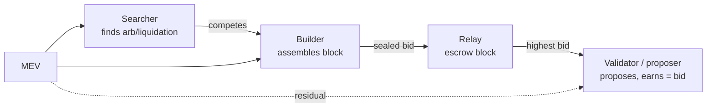

# Micro · Value Distribution in the MEV-Boost Era: Validators, Builders and Searchers

**Research Note No.02 · Tokenomics · Blockchain Economics & Trends**

- **Author**: Bonnie Bennett (Senior Data Analyst / Data Scientist)
- **Published**: 2026-10
- **Method**: public MEV-Boost relay bidtrace API (key-less) + concentration (HHI) & distribution analysis
- **Code/Data**: [`tools/build_charts.py`](../tools/build_charts.py), [`data/`](../data)
- 🌐 [中文版](02-mev-boost-value-distribution.md)
- **One-line conclusion**: In the PBS (Proposer–Builder Separation) era, ordering-rights rent has migrated en masse from "validators" to "builders" and "searchers"; validators only receive the **post-auction residual** — the **top-3 builders capture ~40% of MEV value (HHI ≈ 0.09)**, a "moderately concentrated, leader-dominated" market.

> **Disclaimer**: academic and portfolio purposes only; not investment advice. Data are live snapshots from public relay APIs; provenance in [`data/README.md`](../data/README.md).

---

## Abstract

After **The Merge**, Ethereum settled into the **PBS (Proposer–Builder Separation)** paradigm: **validators (proposers) no longer build blocks themselves**; they auction the right to build to **builders**, who buy arbitrage/liquidation opportunities from **searchers**. This split breaks the MEV value chain into three layers:

```
searcher (finds opportunity) → builder (assembles block, bids) → validator/proposer (proposes, gets the bid)
```

Using **MEV-Boost relay bidtrace data** (5 relays × 100 blocks = **500 blocks**), this note maps value distribution along that chain:

- **Finding 1 (scale)**: the **mean per-block MEV value is 0.0126 ETH**, the median far below the mean (long tail), the max **1.339 ETH** — MEV is a power-law phenomenon where a few blocks carry most of the value.
- **Finding 2 (concentration)**: **30 distinct builders** appear, yet the **top-3 builders take ~39.8%** of value, **HHI ≈ 0.0898** — "moderately concentrated"; a clear leader effect but not (yet) monopolistic.
- **Finding 3 (relay heterogeneity)**: average per-block MEV varies by relay (0.009–0.0216 ETH); relays hosting a few huge blocks see their mean pulled up by the long tail.
- **Finding 4 (mechanics)**: validators receive the "second-best bid"; the real rent accrues to searchers and builders with **information advantages over ordering**. This complements EIP-1559 turning the base fee into a public good (burnt) — **ordering-rights rent (MEV) is the true "private tax" of contemporary Ethereum**.

**Policy implication**: exchanges and institutions must include **MEV (relay payments)** when assessing validator revenue, and recognise that this revenue is **highly sensitive to builder-market structure and regulation** (e.g. MEV-Burn, order-flow auctions).

---

## 1. Research questions

**"Under PBS, who captures ordering-rights rent?"** Decomposed into observable questions:

- **RQ1**: is the per-block MEV value distribution "uniform" or "power-law"?
- **RQ2**: is the builder market competitive or concentrated (HHI / top-3 share)?
- **RQ3**: does value capture systematically differ across relays?

## 2. Background: PBS and the MEV supply chain

### 2.1 From MEV to PBS

"Flash Boys 2.0" (Daian et al., 2019) showed that **transaction ordering** is an arbitrageable economic resource (MEV). As MEV bidding intensified, searching for MEV in-house became uneconomic for validators, so **MEV-Boost** emerged: validators delegate block-building to a relay; builders submit sealed bids; **the highest bid wins the right to propose**, and the validator receives that bid.



### 2.2 The three roles

| Role | Function | Revenue | Moat |
| --- | --- | --- | --- |
| Searcher | Finds on-chain arbitrage | Arbitrage profit | Algorithmic speed, private order flow |
| Builder | Assembles the best block | bid − cost (paid to searchers) | Routing, information, scale |
| Validator/proposer | Proposes the block | Second-best bid (relay paid) | Staked capital |

**The PBS tension**: by outsourcing block-building, validators **outsource MEV competition** to the builder market — and thus hand the **information asymmetry** to others. They receive the auction outcome, not the MEV itself.

## 3. Literature review

- Daian et al. (2019): defines MEV and the value of ordering; flags consensus instability.
- Budish & Gans (2023): auction-design choices for DEXs and MEV.
- Flashbots (2021–): MEV-Boost/PBS as engineering mitigations for MEV centralisation.
- Roughgarden (2021): beyond the fee mechanism, **ordering rights** are the remaining source of value.
- This note's contribution: using **relay-level bidtrace micro-data**, it turns the "who gets the value" debate into **reproducible concentration and distribution evidence**.

---

## 4. Data and method

### 4.1 Sources

| Data | Source | Notes |
| --- | --- | --- |
| Relay bidtrace | `/relay/v1/data/bidtraces/proposer_payload_delivered` on `boost-relay.flashbots.net`, `relay.ultrasound.money`, `agnostic-relay.net`, `aestus.live`, `titanrelay.xyz` | fields: `value` (wei paid to proposer), `gas_used`, `num_tx`, `builder_pubkey` |

Sample: **5 relays × latest 100 blocks = 500 blocks** (snapshot).

### 4.2 Metrics

- **Per-block MEV value** `v = value / 1e18` (ETH)
- **Builder concentration**: HHI = Σ(share²); **top-3 value share**
- **Relay average value**: each relay's `mean(v)`

### 4.3 Caveats

1. bidtrace only records blocks **successfully delivered via a relay**, not off-relay blocks;
2. `value` is the **bid paid to the proposer**, not total on-chain MEV (searcher/builder margins are invisible);
3. 100 blocks/relay is a **small sample**; concentration metrics have sampling noise.

---

## 5. Results

> **Data note**: all charts are fetched live from public relay APIs and rendered to SVG by [`tools/build_charts.py`](../tools/build_charts.py), **no Dune needed**. Each figure is captioned with its name, meaning and source.

### Figure 2-1 · Per-block MEV value distribution


*Figure 2-1 · Histogram of per-block MEV value (proposer payload value). Meaning: the x-axis is the MEV value (ETH) a relay paid the proposer in a block, the y-axis is frequency; the distribution is strongly right-skewed — **most blocks carry tiny MEV while a few carry the bulk of value**. Source: MEV-Boost relay bidtrace API, 500 blocks.*

**Takeaway**: mean **0.0126 ETH**, max **1.339 ETH** (~106× the mean).

### Figure 2-2 · Builder concentration: top-10 share


*Figure 2-2 · Top-10 builders' share of MEV value. Meaning: the x-axis is the builder `builder_pubkey` prefix (anonymous), the y-axis is that builder's value share; a higher curve means a more concentrated market. Source: relay bidtrace.*

**Takeaway**: **30** builders appear; the **top-3 share ~39.8%** of value; **HHI ≈ 0.0898** (moderately concentrated).

### Figure 2-3 · MEV value vs block gas used


*Figure 2-3 · Per-block MEV value vs gas used. Meaning: the x-axis is block gas, the y-axis is MEV value; the cloud is **loose**, so high MEV is not simply "full blocks" — it depends on the **arbitrage value of the transactions** (information rent > capacity rent). Source: relay bidtrace.*

### Figure 2-4 · Average per-block MEV by relay


*Figure 2-4 · Average per-block MEV value by relay. Meaning: the x-axis is the relay, the y-axis its average MEV payment over the latest 100 blocks; differences reflect **block quality / order flow**. Source: each relay's public API.*

**Takeaway**: Flashbots 0.009, ultrasound 0.0106, Aestus 0.0108, Titan 0.0108, Agnostic 0.0216 ETH (Agnostic pulled up by a couple of outsized blocks).

---

## 6. Discussion: who captures ordering-rights rent?

### 6.1 Validators: from "rentier" to "auction beneficiary"
Under PBS validators no longer capture MEV directly; they **auction the proposing right** and receive the competitive (second-best) bid — a stable but compressed auction revenue of a monopolised resource.

### 6.2 Builders: a marketised "building monopolist"
Top-3 taking ~40% shows the builder market is **not perfectly competitive**: better order flow and routing give scale advantages — a **centralisation risk** since a few builders shape block content.

### 6.3 Searchers: the original capturers of information rent
Searcher profit (invisible in bidtrace) comes from **information asymmetry** — exclusive order flow and arbitrage opportunities. It is the **least observable, highest-margin** link in the chain.

### 6.4 Echoing Note 01
EIP-1559 made the base fee a "public good" (burnt, returned to all holders); MEV is the **un-publicised "private tax"** captured by the builder/searcher market. Together they complete the picture of "who pays for block space, and to whom".

---

## 7. Conclusions and recommendations

### 7.1 Conclusions
1. MEV is **long-tailed/power-law** (mean 0.0126 ETH, max 1.339 ETH);
2. The builder market is **moderately concentrated** (HHI 0.0898, top-3 ≈ 39.8%);
3. Relay value differs markedly, reflecting order-flow stratification;
4. Validators get the **auction residual**; the real rent goes to builders/searchers.

### 7.2 Recommendations
- **A | Include MEV in validator real-yield models** — ignoring relay payments materially understates execution-layer revenue.
- **B | Monitor builder concentration** — treat HHI and top-3 share as on-chain "health" indicators in exchange research.
- **C | Watch MEV-redistribution designs** — MEV-Burn and OFA will change value distribution; model them forward-looking.

---

## 8. Limitations and future work

1. Only 500 blocks; extend **across time windows** to observe concentration dynamics;
2. `value` is a bid, not total MEV; searcher/builder margins require **private order-flow data**;
3. Future work: the **joint redistribution of MEV and EIP-1559** (Note 01 × Note 02).

## 9. References
See [`references/bibliography.md`](../references/bibliography.md): Daian et al. (2019); Budish & Gans (2023); Roughgarden (2021); Flashbots MEV-Boost docs.

---

*© 2026 Bonnie Bennett · text CC BY 4.0 · SQL/code MIT · a job-application portfolio piece, not investment advice.*

