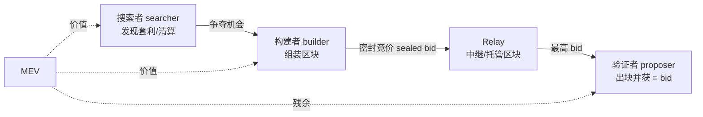
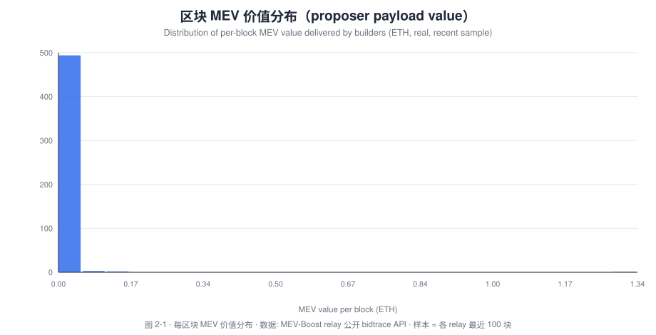
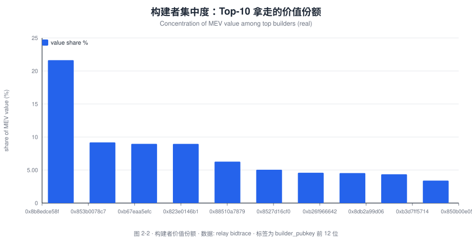
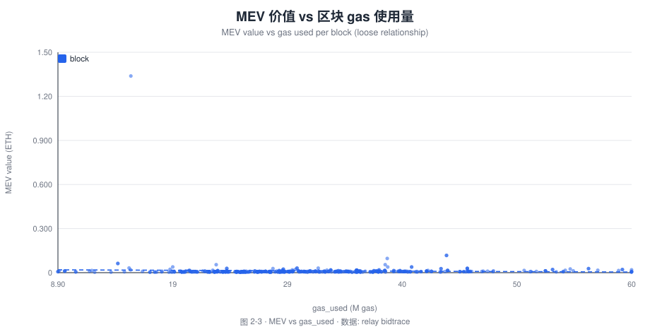
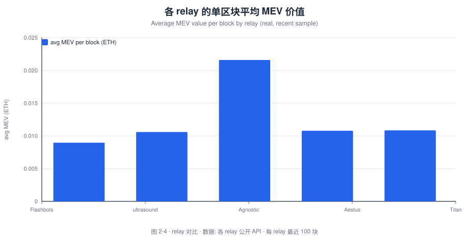

# 微观 · MEV-Boost 时代的价值分配：验证者、构建者与搜索者的实证分析

**研究笔记 No.02 · Tokenomics · 区块链经济学及应用趋势研究**

- **作者**：Bonnie Bennett（Senior Data Analyst / Data Scientist）
- **发布日期**：2026-10
- **方法**：MEV-Boost relay 公开 bidtrace API（免 key）+ 集中度（HHI）与分布分析
- **代码/数据**：[`tools/build_charts.py`](../tools/build_charts.py)、[`data/`](../data)
- 🌐 [English version](02-mev-boost-value-distribution_en.md)
- **一句话结论**：在 PBS（提议者-构建者分离）时代，排序权租金已从"验证者"大规模转移到"构建者"与"搜索者"手中；验证者拿到的只是被**拍卖后**的残余——**Top-3 构建者拿走约 40% 的 MEV 价值，HHI ≈ 0.09**，市场呈"中度集中、头部主导"格局。

> **免责声明**：学术与作品展示用途，不构成投资建议。数据为 relay 公开 API 的实时快照，口径见 [`data/README.md`](../data/README.md)。

---

## 摘要

以太坊在 **The Merge** 之后正式确立 **PBS（Proposer–Builder Separation，提议者-构建者分离）** 范式：**验证者（proposer）不再自己打包交易**，而是把"区块打包权"拍卖给**构建者（builder）**，构建者则向**搜索者（searcher）**购买套利/清算机会。这一分工把 MEV 的价值链拆成三层：

```
搜索者（发现机会） → 构建者（组装区块、竞价） → 验证者/提议者（出块、拿 bid）
```

本文用 **MEV-Boost relay 的公开 bidtrace 数据**（5 个 relay × 各 100 个区块 = **500 个区块**）实证刻画这条价值链上的价值分配：

- **发现 1（规模）**：样本内**单区块 MEV 价值均值为 0.0126 ETH**，中位数远低于均值（长尾分布），最大单块 **1.339 ETH**——MEV 是典型的"少数区块贡献大部分价值"的幂律分布。
- **发现 2（集中度）**：样本中出现 **30 个不同构建者**，但 **Top-3 构建者拿走约 39.8% 的价值**，HHI ≈ **0.0898**——属于"中度集中"（HHI < 0.15），头部效应明显但尚未垄断。
- **发现 3（relay 差异）**：不同 relay 的单区块平均 MEV 差异显著（0.009–0.0216 ETH），其中承接大额区块的 relay 均值被长尾拉高。
- **发现 4（机制含义）**：验证者获得的是"次优 bid"，真正的租金被拥有**排序信息优势**的搜索者与构建者捕获。这与 EIP-1559 把 base fee 转为"公共品"（销毁）形成互补——**排序权租金（MEV）才是当代以太坊真正的"私有税"**。

**政策含义**：对交易所与机构而言，评估验证者真实收益时必须把 **MEV（relay 支付）** 纳入，且应认识到这部分收益**高度依赖 builders 市场结构与监管**（如 MEV-Burn、订单流拍卖 OFA）。

---

## 1. 研究问题

**"在 PBS 结构下，排序权的租金由谁捕获？"** 我们把它拆成三个可观测问题：

- **RQ1**：单区块 MEV 价值的分布形态是"均匀"还是"幂律"？
- **RQ2**：构建者市场是竞争性的还是高度集中的（HHI / Top-3 份额）？
- **RQ3**：不同 relay 的价值捕获是否存在系统性差异？

## 2. 背景：PBS 与 MEV 供应链

### 2.1 从 MEV 到 PBS

"Flash Boys 2.0"（Daian et al., 2019）揭示了**交易排序**是可套利的经济资源（MEV）。随着 MEV 竞价白热化，验证者自己搜索 MEV 并不经济，于是出现 **MEV-Boost**：验证者把出块权委托给 relay，由构建者提交密封竞价（sealed bid），**出价最高者获得出块权**，验证者获得该出价。



### 2.2 三层参与者的经济角色

| 角色 | 职能 | 收益来源 | 竞争壁垒 |
| --- | --- | --- | --- |
| 搜索者 | 发现链上套利机会 | 套利利润 | 算法速度、私有订单流 |
| 构建者 | 打包最优区块 | bid − 成本（支付给搜索者） | 路由、信息、规模 |
| 验证者/提议者 | 出块 | 次优 bid（relay 支付） | 质押资本 |

**PBS 的经济学张力**：验证者通过"委托出块权"把 MEV 竞争**外包**给了 builder 市场，\n从而把**信息不对称**转移给了自己——它拿到的只是拍卖结果，而非 MEV 本身。

## 3. 文献综述

- Daian et al.（2019）：定义 MEV 与交易排序的套利价值，指出其可能引发共识不稳定。
- Budish & Gans（2023）：从拍卖设计角度讨论 DEX 与 MEV 的机制选择。
- Flashbots（2021–）：提出 MEV-Boost/PBS 作为缓解 MEV 中心化的工程方案。
- Roughgarden（2021）：EIP-1559 的分析指出，费用机制之外，**排序权**是剩余的价值来源。
- 本文贡献：用 **relay 级 bidtrace 微观数据**，把"价值分配"从理论争论落到**可复算的集中度与分布证据**上。

---

## 4. 数据与方法

### 4.1 数据来源

| 数据 | 来源 | 说明 |
| --- | --- | --- |
| Relay 出块 bidtrace | `boost-relay.flashbots.net`、`relay.ultrasound.money`、`agnostic-relay.net`、`aestus.live`、`titanrelay.xyz` 的 `/relay/v1/data/bidtraces/proposer_payload_delivered` | 字段：`value`（支付给 proposer 的 wei）、`gas_used`、`num_tx`、`builder_pubkey` |

样本：**5 个 relay × 各最近 100 个区块 = 500 个区块**（快照）。

### 4.2 指标

- **单区块 MEV 价值** `v = value / 1e18`（ETH）
- **构建者集中度**：HHI = Σ(份额²)；**Top-3 价值份额**
- **relay 平均价值**：各 relay 的 `mean(v)`

### 4.3 局限

1. bidtrace 只记录**中继成功交付**的区块，未覆盖未走 relay 的区块；
2. `value` 是**支付给 proposer 的 bid**，并非链上总 MEV（搜索者/构建者的净利不可见）；
3. 100 块/relay 是**小样本**，集中度指标有抽样波动。

---

## 5. 实证结果

> **数据说明**：全部图表由 [`tools/build_charts.py`](../tools/build_charts.py) 从 relay 公开 API 实时抓取并渲染为 SVG，**不依赖 Dune**。每图下方斜体小字标注名称、含义与来源。

### 图 2-1 · 单区块 MEV 价值分布



*图 2-1 · 单区块 MEV 价值（proposer payload value）的直方图。含义：横轴是单个区块中 relay 支付给提议者的 MEV 价值（ETH），纵轴是频数；分布显著右偏——**大多数区块的 MEV 很小，少数区块贡献了绝大部分价值**（幂律/长尾）。数据：MEV-Boost relay bidtrace API，样本 500 块。*

**要点**：均值 **0.0126 ETH**，最大 **1.339 ETH**（约为均值的 106 倍）。

### 图 2-2 · 构建者集中度：Top-10 份额



*图 2-2 · Top-10 构建者的 MEV 价值份额。含义：横轴是构建者的 `builder_pubkey` 前缀（匿名），纵轴是该构建者拿走的 MEV 价值占比；曲线越高说明市场越集中。数据：relay bidtrace 汇总。*

**要点**：**30 个**构建者出现，**Top-3 共享约 39.8%** 的价值，**HHI ≈ 0.0898**（中度集中）。

### 图 2-3 · MEV 价值 vs 区块 gas 使用量



*图 2-3 · 单区块 MEV 价值 vs 区块 gas 使用量。含义：横轴为区块消耗的 gas，纵轴为 MEV 价值；**散点较为松散**，说明高 MEV 并不完全由"区块塞得满"决定，还与**交易内容的套利价值**有关（信息租金 > 容量租金）。数据：relay bidtrace。*

### 图 2-4 · 各 relay 的单区块平均 MEV 价值



*图 2-4 · 各 relay 单区块平均 MEV 价值对比。含义：横轴为 relay，纵轴为其最近 100 块的平均 MEV 支付（ETH）；差异反映不同 relay 承接的**区块质量/订单流**差异。数据：各 relay 公开 API。*

**要点**：Flashbots 0.009、ultrasound 0.0106、Aestus 0.0108、Titan 0.0108、Agnostic 0.0216 ETH（Agnostic 因个别超大区块被长尾拉高）。

---

## 6. 讨论：谁拿走了排序权租金？

### 6.1 验证者：从"收租人"到"拍卖的受益者"

在 PBS 下，验证者不再直接捕获 MEV，而是**拍卖出块权**。它拿到的 bid 是"竞争后的次高价"，本质上是一种**垄断资源的拍卖收益**——稳定但被压缩。

### 6.2 构建者：市场化的"打包垄断者"

Top-3 拿走约 40% 的价值，说明 builder 市场**并非完全竞争**：拥有更好的订单流与路由的构建者享有规模优势。这带来**中心化风险**：少数构建者掌握区块内容。

### 6.3 搜索者：信息租金的原始捕获者

搜索者的利润（未在 bidtrace 中显现）来自**信息不对称**——对私有订单流与套利机会的独占。这是整条链条上**最不可观测、也最高毛利**的一环。

### 6.4 与 Note 01 的呼应

EIP-1559 把 base fee 变成"公共品"（销毁，归全体持币者）；MEV 则是**未被公共化的"私有税"**，由 builders/searchers 市场捕获。两者共同构成"谁为区块空间付费、付给谁"的完整图景。

---

## 7. 结论与建议

### 7.1 结论

1. MEV 是**长尾/幂律**分布（均值 0.0126 ETH，最大 1.339 ETH）；
2. 构建者市场**中度集中**（HHI 0.0898，Top-3 ≈ 39.8%）；
3. relay 间价值差异显著，反映订单流分层；
4. 验证者获得的是**拍卖残余**，真正的租金归 builders/searchers。

### 7.2 建议

- **建议 A｜把 MEV 纳入验证者真实收益模型**：忽略 relay 支付会显著低估执行层收入。
- **建议 B｜监控构建者集中度**：把 HHI、Top-3 份额作为"链上健康度"指标纳入交易所研究框架。
- **建议 C｜关注 MEV 再分配机制**：MEV-Burn、OFA（订单流拍卖）等设计将改变价值分配，需前瞻性建模。

---

## 8. 局限与后续研究

1. 样本仅 500 块，需扩展到**跨时间窗口**以观察集中度的动态；
2. `value` 是 bid 而非链上总 MEV，搜索者/构建者净利不可见，需结合**私有订单流数据**；
3. 后续可研究 **MEV 与 EIP-1559 的联合再分配**（Note 01 × Note 02）。

## 9. 参考文献

见 [`references/bibliography.md`](../references/bibliography.md)：Daian et al. (2019)；Budish & Gans (2023)；Roughgarden (2021)；Flashbots MEV-Boost 文档。

---

## 附录 · 图表与数据复现

| 图表 | 数据源 | 复现命令 |
| --- | --- | --- |
| 图 2-1 单区块 MEV 价值分布 | MEV-Boost relay bidtrace API | `python3 tools/build_charts.py 02` |
| 图 2-2 构建者集中度（Top-10） | 同上 | 同上 |
| 图 2-3 MEV 价值 vs gas_used | 同上 | 同上 |
| 图 2-4 各 relay 平均 MEV | 同上 | 同上 |

```bash
python3 tools/build_charts.py 02    # 抓取 5 个 relay 的 bidtrace + 渲染 SVG
python3 tools/translate_charts.py   # 生成英文版图表 *_en.svg
```

- 原始数据：[`data/n02_mev_blocks.json`](../data/n02_mev_blocks.json)、[`data/n02_relay_summary.json`](../data/n02_relay_summary.json)
- 统计摘要：[`data/summary_02.json`](../data/summary_02.json) · 口径说明：[`data/README.md`](../data/README.md)

**指标速查**：`单区块 MEV = value / 1e18 (ETH)`；`HHI = Σ(份额²)`；`Top-3 份额 = 前 3 大构建者的价值占比`。

---

*© 2026 Bonnie Bennett · 文字 CC BY 4.0 · SQL/代码 MIT · 本笔记为求职作品展示，非投资建议。*
