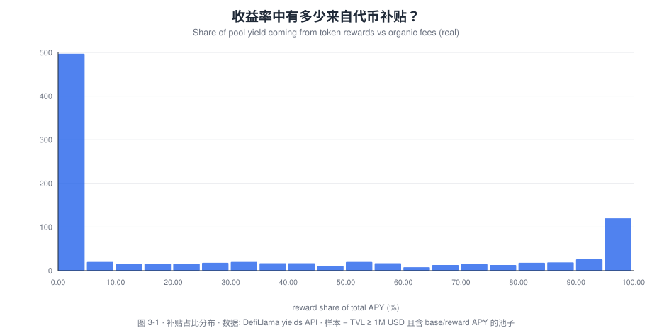
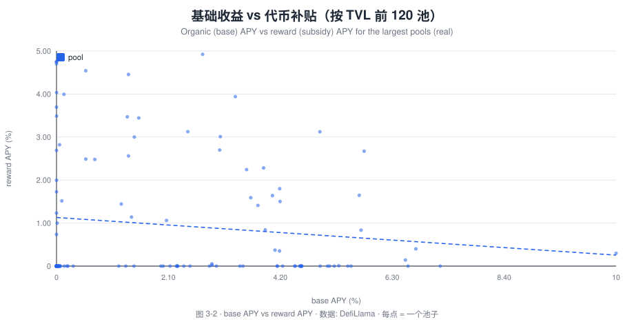
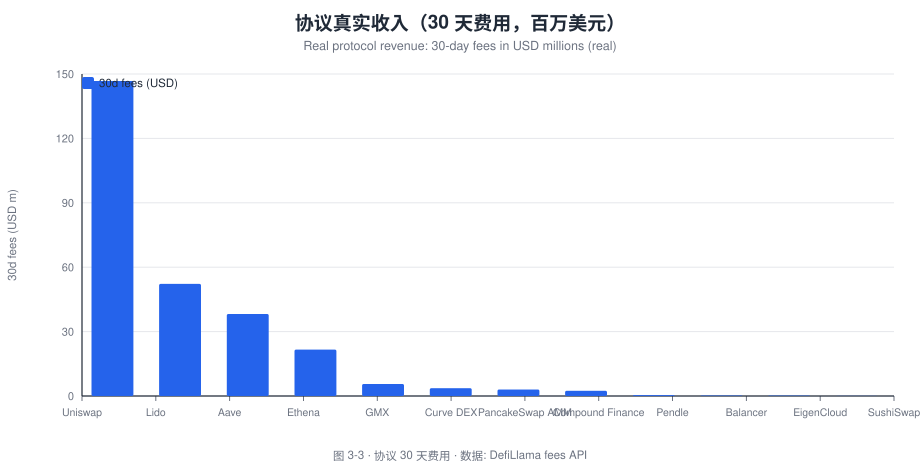
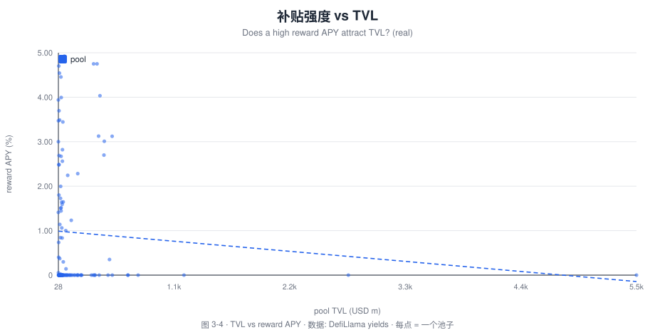

# 流动性挖矿的补贴效率：代币激励有多少转化成了真实交易量？

**研究笔记 No.03 · Tokenomics · 区块链经济学及应用趋势研究**

- **作者**：Bonnie Bennett（Senior Data Analyst / Data Scientist）
- **发布日期**：2026-10
- **方法**：DefiLlama 开放 API（免 key）+ 补贴占比分解 + TVL/费用交叉分析
- **代码/数据**：[`tools/build_charts.py`](../tools/build_charts.py)、[`data/`](../data)
- 🌐 [English version](03-liquidity-mining-subsidy-efficiency_en.md)
- **一句话结论**：绝大多数 DeFi 池子的收益来自**真实手续费**（补贴占比中位数仅 **0.6%**），但存在一个**长尾**——**146 个池子的收益 90% 以上来自代币补贴**，这些池子本质是"代币换 TVL"的短期租赁。补贴效率的两极分化，正是判断协议可持续性的关键。

> **免责声明**：学术与作品展示用途，不构成投资建议。数据为 DefiLlama 实时快照，口径见 [`data/README.md`](../data/README.md)。

---

## 摘要

流动性挖矿（liquidity mining）本质是一种**补贴**：协议用代币激励"借来"流动性，期望它转化为**真实的交易量与手续费收入**。但补贴存在一个根本性经济学问题——**代币激励有多少转化成了真实需求，又有多少只是"挖提卖"（farm-and-dump）的租金？**

本文用 **DefiLlama 的协议费用与池子收益率数据**（12 个主流协议 + **985 个 TVL ≥ $1M 的池子**），定义并度量**补贴效率**：

```
补贴占比 subsidy_share = apyReward / (apyBase + apyReward)
```

- **发现 1（两极分化）**：985 个池子的补贴占比**均值 29.5%、中位数仅 0.6%**——说明**大多数池子的收益几乎全部来自真实手续费**，但**少数池子**被代币补贴主导，把均值拉高。这正是"均值 vs 中位数"背离的经典信号。
- **发现 2（纯农场池）**：**146 个池子**（约占样本 15%）的收益 **90% 以上来自代币补贴**——它们更像"用代币租来的 TVL"，一旦补贴停止，流动性大概率流失。
- **发现 3（真实收入集中）**：协议真实收入高度集中于少数头部——**30 天费用**：Uniswap **$146.8M**、Lido **$52.2M**、Aave **$38.2M**、Ethena **$21.6M**、GMX **$5.6M**、Curve DEX **$3.6M**。
- **发现 4（补贴与 TVL 的关系）**：高补贴 APY 并未与高 TVL 呈稳定正相关——单纯靠补贴"买"TVL 的效率递减，符合"补贴的边际收益递减"。

**政策含义**：对协议而言，**补贴应瞄准"能否转化为不可逆的真实需求"**（网络效应、集成、粘性），而非短期 TVL 数字；对交易所研究部而言，**补贴占比**应成为评估 DeFi 代币可持续性与"TVL 质量"的标配指标。

---

## 1. 研究问题

- **RQ1**：DeFi 池子的收益中，有多大比例来自**代币补贴**而非真实手续费？
- **RQ2**：补贴强度与 TVL 是否存在稳定关系（补贴能否"买来"流动性）？
- **RQ3**：协议的真实收入（费用）在头部有多集中？

## 2. 背景：补贴经济学的三个陷阱

1. **女巫/租赁资本（mercenary capital）**：农户追逐最高 APY，补贴一停就走，TVL 是"租来的"。
2. **代币通胀的成本**：补贴以稀释持币者为代价，若未换来持久需求，等于**用股东权益支付运营费用**。
3. **计量幻觉**：TVL 是"快照",补贴是"流量";用 TVL 衡量补贴成效会高估效率。

衡量补贴效率的干净指标是**补贴占比**与**真实费用/TVL**。

## 3. 文献综述

- Schär（2021）：DeFi 的机制与风险综述，指出激励设计的可持续性问题。
- Lehar & Parlour（2021）、Capponi & Jia（2021）：AMM 的微观结构与流动性提供者收益。
- 本文贡献：用**跨协议、跨池子的大样本**，给出**补贴占比分布**与**真实收入集中度**的可复算证据。

---

## 4. 数据与方法

| 数据 | 来源 | 说明 |
| --- | --- | --- |
| 协议费用 | DefiLlama `summary/fees/{protocol}` | `total30d` 等 |
| 池子收益率 | DefiLlama `yields.llama.fi/pools` | `apyBase`、`apyReward`、`tvlUsd` |

- 样本：**12 个协议** + **985 个 TVL ≥ $1M 且含 base/reward APY 的池子**。
- 核心指标：`subsidy_share = apyReward /(apyBase + apyReward)`。
- 局限：APY 为瞬时值、补贴代币按当前价折算；TVL 含补贴资产的重复计价。

---

## 5. 实证结果

> **数据说明**：图表由 [`tools/build_charts.py`](../tools/build_charts.py) 从 DefiLlama 实时抓取并渲染为 SVG，**不依赖 Dune**。斜体小字标注名称、含义与来源。

### 图 3-1 · 收益率中有多少来自代币补贴？



*图 3-1 · 池子补贴占比（reward share）的分布。含义：横轴为"收益中来自代币补贴的百分比"，纵轴为池子频数；**大量池子集中在 0 附近（收益几乎全为真实手续费）**，同时右侧存在一个"纯补贴"长尾。数据：DefiLlama yields API，样本 985 个池子。*

**要点**：均值 **29.5%**，中位数 **0.6%**，**146 个池子补贴占比 > 90%**。

### 图 3-2 · 基础收益 vs 代币补贴（按 TVL 前 120 池）



*图 3-2 · 基础收益（base APY）vs 代币补贴（reward APY）。含义：横轴是真实手续费收益，纵轴是补贴收益；点在右下（高补贴、低基础）即"靠补贴维持"的池子。数据：DefiLlama yields。*

### 图 3-3 · 协议真实收入（30 天费用）



*图 3-3 · 头部协议 30 天费用（百万美元）。含义：这是**真实、非补贴**的收入，用来衡量协议"内生"的赚钱能力。数据：DefiLlama fees API。*

**要点**：Uniswap $146.8M、Lido $52.2M、Aave $38.2M、Ethena $21.6M、GMX $5.6M、Curve DEX $3.6M——**头部效应极强**。

### 图 3-4 · 补贴强度 vs TVL



*图 3-4 · 池子 TVL vs 补贴 APY。含义：横轴为池子 TVL（百万美元），纵轴为补贴 APY；若补贴能"买来" TVL，应看到右上聚集，实际**较为分散**，说明高补贴未必带来高 TVL。数据：DefiLlama yields。*

---

## 6. 讨论：补贴的"转化率"

把补贴看作一笔**市场营销费用**，其 ROI = **带来的持久真实费用 / 补贴支出**：

- 对 **Uniswap/Aave** 这类"高真实费用、低补贴占比"的协议，补贴是**锦上添花**；
- 对 **146 个纯补贴池**，补贴更像**用代币买 TVL 的短期租赁**，ROI 存疑；
- 关键在于**补贴是否转化为不可逆需求**（集成、品牌、网络效应），而非当期 TVL。

## 7. 结论与建议

1. **补贴占比是"TVL 质量"的核心指标**——中位数 0.6% 说明 DeFi 整体仍以真实收益为主，但需警惕 15% 的纯补贴长尾。
2. **建议 A｜补贴聚焦转化率**：优先补贴能带来持久费用/集成的池子，而非最高 APY。
3. **建议 B｜交易所/机构用补贴占比做尽调**：把它同 TVL、真实费用一起纳入 DeFi 代币的可持续性评分。
4. **建议 C｜披露补贴的稀释成本**：把代币排放按市值折算为"隐形运营支出"，让持币者看清真实成本。

## 8. 局限与后续研究

1. APY/TVL 为瞬时快照，需**时间序列**观察补贴退出后的流动性留存（"补贴退坡实验"）；
2. 需引入**代币排放的美元成本**，计算补贴的真实 ROI；
3. 后续可做**事件研究**：补贴终止前后 TVL/费用的变化（自然实验）。

## 9. 参考文献

见 [`references/bibliography.md`](../references/bibliography.md)：Schär (2021)；Lehar & Parlour (2021)；Capponi & Jia (2021)。

---

## 附录 · 图表与数据复现

| 图表 | 数据源 | 复现命令 |
| --- | --- | --- |
| 图 3-1 补贴占比分布 | DefiLlama yields API | `python3 tools/build_charts.py 03` |
| 图 3-2 base APY vs reward APY | 同上 | 同上 |
| 图 3-3 协议 30 天费用 | DefiLlama fees API | 同上 |
| 图 3-4 TVL vs reward APY | DefiLlama yields | 同上 |

```bash
python3 tools/build_charts.py 03    # 抓取 12 个协议费用 + 985 个池子收益率 + 渲染 SVG
python3 tools/translate_charts.py   # 生成英文版图表 *_en.svg
```

- 原始数据：[`data/n03_protocol_fees.json`](../data/n03_protocol_fees.json)、[`data/n03_pools_sample.json`](../data/n03_pools_sample.json)
- 统计摘要：[`data/summary_03.json`](../data/summary_03.json) · 口径说明：[`data/README.md`](../data/README.md)

**指标速查**：`subsidy_share = apyReward /(apyBase + apyReward)`；`补贴效率 = 持久真实费用 / 补贴支出`。

---

*© 2026 Bonnie Bennett · 文字 CC BY 4.0 · SQL/代码 MIT · 本笔记为求职作品展示，非投资建议。*
