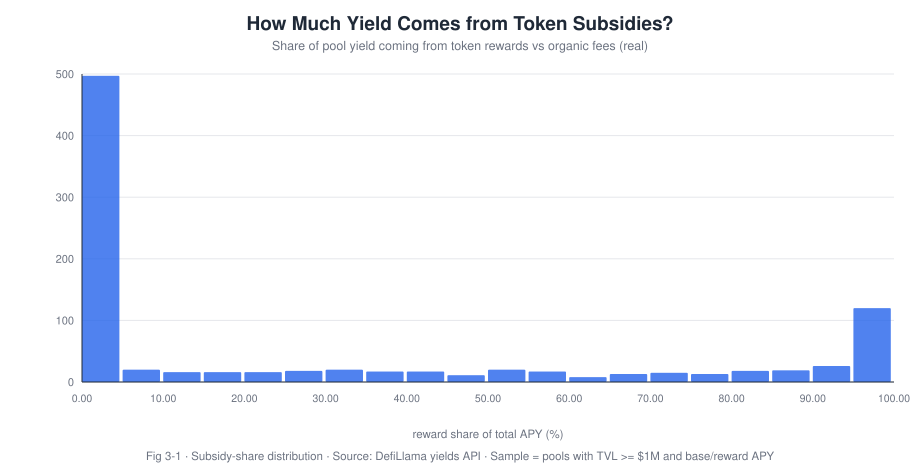
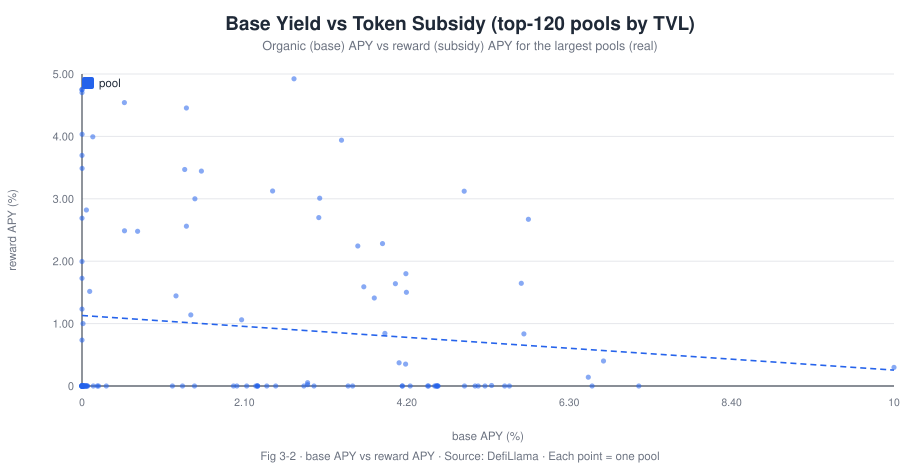
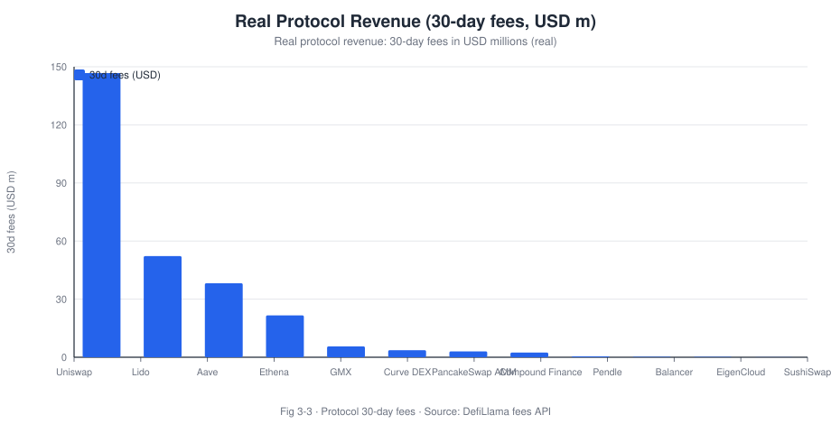
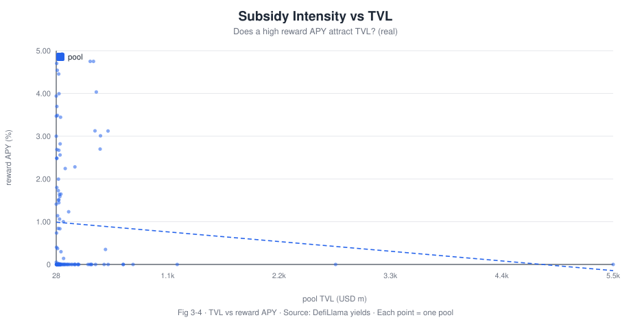

# Meso · The Subsidy Efficiency of Liquidity Mining: How Much Incentive Becomes Real Volume?

**Research Note No.03 · Tokenomics · Blockchain Economics & Trends**

- **Author**: Bonnie Bennett (Senior Data Analyst / Data Scientist)
- **Published**: 2026-10
- **Method**: DefiLlama open API (key-less) + subsidy-share decomposition + TVL/fee cross-analysis
- **Code/Data**: [`tools/build_charts.py`](../tools/build_charts.py), [`data/`](../data)
- 🌐 [中文版](03-liquidity-mining-subsidy-efficiency.md)
- **One-line conclusion**: most DeFi pools earn their yield from **real fees** (median subsidy share just **0.6%**), yet there is a **long tail** — **146 pools draw >90% of their yield from token subsidies**, essentially "token-for-TVL" short-term rentals. This polarisation is the key to judging protocol sustainability.

> **Disclaimer**: academic and portfolio purposes only; not investment advice. Data are live DefiLlama snapshots; provenance in [`data/README.md`](../data/README.md).

---

## Abstract

Liquidity mining is, in essence, a **subsidy**: a protocol uses token incentives to "borrow" liquidity, hoping it converts into **real volume and fee revenue**. But a fundamental economic question arises — **how much of the incentive becomes real demand, and how much is just farm-and-dump rent?**

Using **DefiLlama protocol-fee and pool-yield data** (12 major protocols + **985 pools with TVL ≥ $1M**), this note defines and measures **subsidy efficiency**:

```
subsidy_share = apyReward / (apyBase + apyReward)
```

- **Finding 1 (polarisation)**: across 985 pools the subsidy share has **mean 29.5% but median only 0.6%** — **most pools' yield is almost entirely real fees**, while a minority are subsidy-dominated and pull the mean up. This mean-vs-median divergence is the classic signature.
- **Finding 2 (pure-farm pools)**: **146 pools** (~15% of the sample) draw **>90% of yield from token subsidies** — closer to "TVL rented with tokens"; when the subsidy stops, liquidity likely leaves.
- **Finding 3 (revenue concentration)**: real protocol revenue is highly concentrated — **30-day fees**: Uniswap **$146.8M**, Lido **$52.2M**, Aave **$38.2M**, Ethena **$21.6M**, GMX **$5.6M**, Curve DEX **$3.6M**.
- **Finding 4 (subsidy vs TVL)**: high reward APY does not translate into reliably high TVL — buying TVL with subsidies has diminishing returns.

**Policy implication**: protocols should target subsidies at demand that **converts into irreversible real usage** (network effects, integrations, stickiness), not short-term TVL numbers; and for exchange research desks, **subsidy share** should be a standard metric for DeFi-token sustainability and "TVL quality".

---

## 1. Research questions

- **RQ1**: what share of a DeFi pool's yield comes from **token subsidies** rather than real fees?
- **RQ2**: is there a stable relationship between subsidy intensity and TVL (can subsidies "buy" liquidity)?
- **RQ3**: how concentrated is real (fee) revenue at the top?

## 2. Background: three traps of subsidy economics

1. **Mercenary capital**: farmers chase the highest APY and leave the moment the subsidy stops — TVL is "rented".
2. **The cost of token inflation**: subsidies dilute holders; without durable demand they are **operating expenses paid with shareholder equity**.
3. **Measurement illusion**: TVL is a *stock*, subsidies are a *flow*; judging subsidy success by TVL overstates efficiency.

The clean measures of subsidy efficiency are **subsidy share** and **real fees / TVL**.

## 3. Literature review

- Schär (2021): a survey of DeFi mechanics and risks, flagging incentive-design sustainability.
- Lehar & Parlour (2021), Capponi & Jia (2021): AMM microstructure and LP returns.
- This note's contribution: a **cross-protocol, cross-pool large sample** giving **reproducible evidence on the subsidy-share distribution and real-revenue concentration**.

---

## 4. Data and method

| Data | Source | Notes |
| --- | --- | --- |
| Protocol fees | DefiLlama `summary/fees/{protocol}` | `total30d` etc. |
| Pool yields | DefiLlama `yields.llama.fi/pools` | `apyBase`, `apyReward`, `tvlUsd` |

- Sample: **12 protocols** + **985 pools with TVL ≥ $1M and both base/reward APY**.
- Core metric: `subsidy_share = apyReward /(apyBase + apyReward)`.
- Caveats: APYs are instantaneous and subsidy tokens are valued at current price; TVL double-counts subsidised assets.

---

## 5. Results

> **Data note**: charts are fetched live from DefiLlama and rendered to SVG by [`tools/build_charts.py`](../tools/build_charts.py), **no Dune needed**. Each figure is captioned with its name, meaning and source.

### Figure 3-1 · How much yield is a token subsidy?



*Figure 3-1 · Distribution of pool subsidy share (reward share). Meaning: the x-axis is the percentage of yield coming from token subsidies, the y-axis is the number of pools; **many pools cluster near 0 (yield almost entirely real fees)** while a "pure-subsidy" tail sits to the right. Source: DefiLlama yields API, 985 pools.*

**Takeaway**: mean **29.5%**, median **0.6%**, **146 pools > 90% subsidised**.

### Figure 3-2 · Base yield vs token subsidy (top-120 pools by TVL)



*Figure 3-2 · Base APY vs reward APY. Meaning: the x-axis is real fee yield, the y-axis is subsidy yield; points in the lower-right (high subsidy, low base) are "subsidy-sustained" pools. Source: DefiLlama yields.*

### Figure 3-3 · Real protocol revenue (30-day fees)



*Figure 3-3 · 30-day fees of leading protocols (USD m). Meaning: this is **real, non-subsidised** revenue — a protocol's "endogenous" earning power. Source: DefiLlama fees API.*

**Takeaway**: Uniswap $146.8M, Lido $52.2M, Aave $38.2M, Ethena $21.6M, GMX $5.6M, Curve DEX $3.6M — a very strong leader effect.

### Figure 3-4 · Subsidy intensity vs TVL



*Figure 3-4 · Pool TVL vs subsidy APY. Meaning: the x-axis is pool TVL (USD m), the y-axis is subsidy APY; if subsidies could "buy" TVL we would see upper-right clustering — instead it is **diffuse**, i.e. high subsidies need not bring high TVL. Source: DefiLlama yields.*

---

## 6. Discussion: the subsidy "conversion rate"

Treating a subsidy as **marketing spend**, its ROI = **durable real fees generated / subsidy cost**:

- For **Uniswap/Aave**-style protocols (high real fees, low subsidy share), subsidies are **icing on the cake**;
- For the **146 pure-subsidy pools**, they are closer to **buying TVL with tokens**, ROI questionable;
- The crux is whether subsidies convert into **irreversible demand** (integrations, brand, network effects), not current TVL.

## 7. Conclusions and recommendations

1. **Subsidy share is the core "TVL quality" metric** — the 0.6% median shows DeFi is still mostly real-yield driven, but watch the ~15% pure-subsidy tail.
2. **A | Aim subsidies at conversion** — prioritise pools that generate durable fees/integrations over the highest APY.
3. **B | Use subsidy share in exchange/institution due diligence** — combine it with TVL and real fees in a DeFi-token sustainability score.
4. **C | Disclose the dilution cost of subsidies** — mark token emissions to market as an "invisible operating expense" so holders see the true cost.

## 8. Limitations and future work

1. APY/TVL are instantaneous; a **time series** is needed to watch liquidity retention after subsidies end (a "subsidy taper experiment");
2. Include the **USD cost of token emissions** to compute the true subsidy ROI;
3. Future work: an **event study** of TVL/fees around subsidy termination (a natural experiment).

## 9. References
See [`references/bibliography.md`](../references/bibliography.md): Schär (2021); Lehar & Parlour (2021); Capponi & Jia (2021).

---

## Appendix · Chart & Data Reproduction

| Chart | Source | Command |
| --- | --- | --- |
| Fig 3-1 subsidy-share distribution | DefiLlama yields API | `python3 tools/build_charts.py 03` |
| Fig 3-2 base APY vs reward APY | idem | idem |
| Fig 3-3 protocol 30-day fees | DefiLlama fees API | idem |
| Fig 3-4 TVL vs reward APY | DefiLlama yields | idem |

```bash
python3 tools/build_charts.py 03    # fetch 12 protocols' fees + 985 pools' yields + render SVG
python3 tools/translate_charts.py   # generate English charts *_en.svg
```

- Raw data: [`data/n03_protocol_fees.json`](../data/n03_protocol_fees.json), [`data/n03_pools_sample.json`](../data/n03_pools_sample.json)
- Summary: [`data/summary_03.json`](../data/summary_03.json) · Provenance: [`data/README.md`](../data/README.md)

**Metric cheat-sheet**: `subsidy_share = apyReward /(apyBase + apyReward)`; `subsidy efficiency = durable real fees / subsidy spend`.

---

*© 2026 Bonnie Bennett · text CC BY 4.0 · SQL/code MIT · a job-application portfolio piece, not investment advice.*

