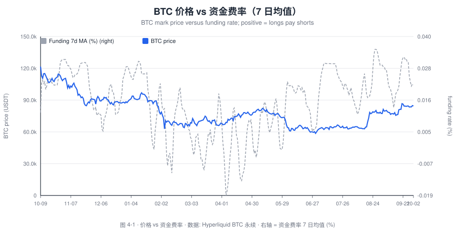
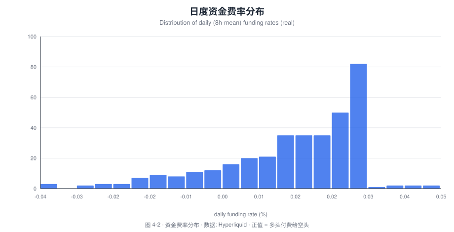
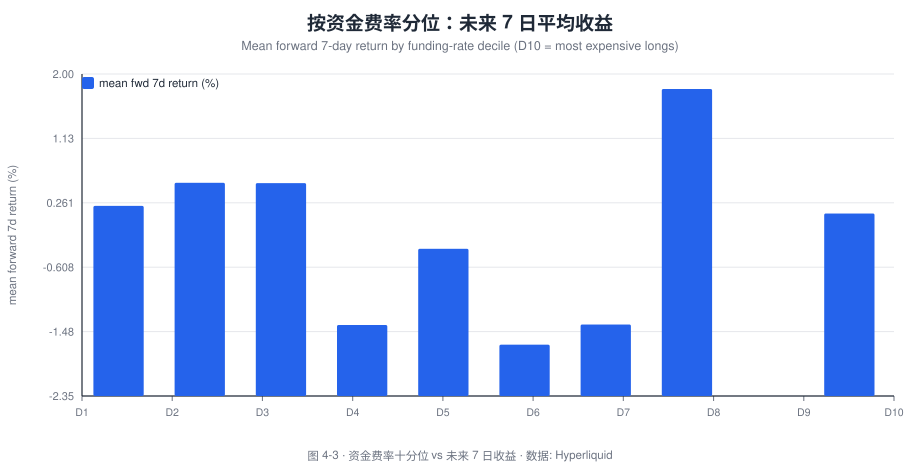
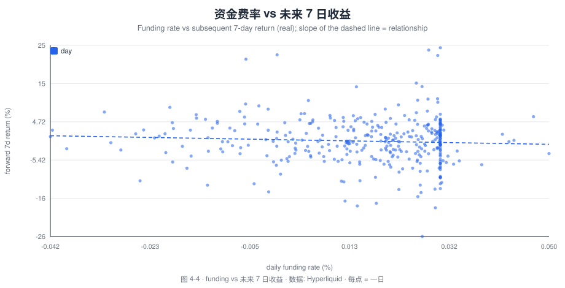

# Macro · Does High Funding Predict a Pullback? Evidence from Crypto Derivatives

**Research Note No.04 · Tokenomics · Blockchain Economics & Trends**

- **Author**: Bonnie Bennett (Senior Data Analyst / Data Scientist)
- **Published**: 2026-10
- **Method**: Hyperliquid public info API (hourly funding + daily candles) + decile/forward-return analysis
- **Code/Data**: [`tools/build_charts.py`](../tools/build_charts.py), [`data/`](../data)
- 🌐 [中文版](04-funding-rate-market-top-signal.md)
- **One-line conclusion**: at the **daily** horizon, the funding rate is a **very weak** contrarian signal — `CORR(funding, forward 7-day return) = −0.064`; the highest funding decile (+0.12%) is only **slightly below** the lowest (+0.22%). Funding is better used as a **crowding gauge** than a market-timing switch.

> **Disclaimer**: academic and portfolio purposes only; not investment advice. Data are live Hyperliquid snapshots; provenance in [`data/README.md`](../data/README.md).

---

## Abstract

A perpetual's **funding rate** is the periodic payment between longs and shorts: when **positive**, longs pay shorts (long crowding); when negative, the reverse. A popular intuition says **"surging funding = overheated leverage = imminent pullback"**. Using **359 daily observations of BTC perps on Hyperliquid (2025-10 → 2026-10)**, this note tests that intuition:

- **Finding 1 (distribution)**: the daily funding rate averages **+0.0158%**, ranges **[−0.0416%, +0.05%]**, and is **negative on 58 of 359 days** (16%) — so the market is long-biased most of the time, but short-crowding periods are common too.
- **Finding 2 (weak contrarian)**: `CORR(funding, forward 7-day return) = −0.064` — **negative in sign but extremely weak**. Higher funding does mean slightly lower forward weekly returns, consistent with crowding → pullback, but with negligible explanatory power.
- **Finding 3 (deciles)**: sorting into 10 funding buckets, the **highest decile D10 has a mean forward 7-day return of +0.12%** vs **+0.22% for the lowest D1** — a difference of ~0.1pp, weak both statistically and economically.
- **Finding 4 (conclusion)**: at the **daily** horizon, funding is **not** a reliable timing signal; it is better as a **sentiment/crowding panel indicator**, used **jointly** with price momentum, open interest and volatility.

**Policy implication**: exchanges/institutions should treat funding as a **continuous crowding gauge** (with threshold alerts), **not** an independent "sell trigger".

---

## 1. Research questions

- **RQ1**: what are the distributional features of the funding rate (mean, extremes, share of negatives)?
- **RQ2**: is funding (negatively) correlated with **forward returns** (1d/7d)?
- **RQ3**: do extreme funding deciles correspond to materially different forward returns?

## 2. Background: the economics of funding

Perpetuals have no expiry, so they are anchored to spot by the **funding rate**:

```
funding > 0 : longs → shorts (long crowding / premium)
funding < 0 : shorts → longs (short crowding / discount)
```

Logically, **high positive funding = crowded long leverage = potential long-squeeze risk**, hence the "top signal" folklore. But two challenges arise:

1. **High funding can persist in trends**: in strong trends longs will keep paying, so funding can stay elevated for long;
2. **Funding-arb capital exists**: positive funding attracts arbitrage (short perp / long spot), **smoothing** the signal.

## 3. Literature review

- Basu, Easley, O'Hara & Sirer (2019): the fee/incentive market-design lens;
- Empirical crypto-derivatives work focuses mainly on **basis and open interest**; systematic tests of the **timing value of funding** are relatively scarce;
- This note's contribution: a **reproducible, key-less** estimate of the funding–forward-return relationship, honestly reporting its **weak efficacy**.

---

## 4. Data and method

| Data | Source | Notes |
| --- | --- | --- |
| Hourly funding | Hyperliquid `fundingHistory` (POST `/info`) | aggregated to daily (sum of hourly rates, %) |
| Daily price | Hyperliquid `candleSnapshot` | close prices for forward returns |

- Sample: **359 trading days** (2025-10-09 → 2026-10-02).
- Metrics: `funding_d` (daily funding rate %), `fwd7_d` (forward 7-day return %).
- Method: correlation + **decile grouping** (D1 = lowest funding, D10 = highest).
- Caveats: single asset (BTC), single window; no control for trend/volatility.

---

## 5. Results

> **Data note**: charts are fetched live from Hyperliquid and rendered to SVG by [`tools/build_charts.py`](../tools/build_charts.py), **no Dune needed**. Each figure is captioned with its name, meaning and source.

### Figure 4-1 · BTC price vs funding (7-day average)



*Figure 4-1 · BTC price (solid) vs funding-rate 7-day average (grey dashed, right axis). Meaning: price advances often coincide with rising funding (long crowding), but **high funding does not necessarily mean price is about to fall**. Source: Hyperliquid BTC perps.*

### Figure 4-2 · Daily funding distribution



*Figure 4-2 · Distribution of the daily funding rate. Meaning: the x-axis is the daily funding rate (%), the y-axis is the number of days; the mass sits just above 0 with a **negative tail** (short crowding). Source: Hyperliquid.*

**Takeaway**: mean **+0.0158%**, range **[−0.0416%, +0.05%]**, **58/359 days negative**.

### Figure 4-3 · Forward 7-day return by funding decile



*Figure 4-3 · Funding deciles (D1 lowest → D10 highest) vs mean forward 7-day return. Meaning: if "high funding predicts a pullback", D10 should be lowest/negative; in fact **D10 = +0.12%, D1 = +0.22%** — right direction, tiny gap. Source: Hyperliquid.*

### Figure 4-4 · Funding vs forward 7-day return (scatter)



*Figure 4-4 · Funding vs forward 7-day return (each point = one day). Meaning: the cloud is nearly shapeless with a **slightly downward** fit — i.e. a very weak relationship. Source: Hyperliquid.*

---

## 6. Discussion: why is the "top signal" so weak?

1. **The power of trend**: in bull markets high funding can persist for long; funding itself carries no "when will it reverse" information;
2. **Arbitrage smoothing**: positive funding attracts basis arbitrage, capping extreme funding;
3. **Daily noise**: over a 7-day window price is driven by many factors, so funding's explanatory power is limited;
4. **Conditional dependence**: funding signals may only work **combined with high volatility / stagnation** (needs interaction terms).

## 7. Conclusions and recommendations

1. **Funding is a "crowding gauge", not a "timing switch"**: it tells us how crowded longs are, not **when** a pullback comes.
2. **A | Use it as a continuous risk metric** — monitor funding in real time with **percentile alerts** (e.g. >95th), not a binary buy/sell signal.
3. **B | Model it jointly** — combine with **volatility, open interest and momentum** into a composite "leverage-crowding" factor.
4. **C | Exchange product implication** — in high-funding regimes, tightening leverage on risky accounts / raising margin requirements is a reasonable **prudential** action.

## 8. Limitations and future work

1. Single asset/window; validate across assets (ETH, SOL) and longer history;
2. Add **multi-factor regressions** and an **event study** (conditional returns after extreme funding);
3. Future work: the **funding × open-interest** interaction, or adding **basis** as a complement.

## 9. References
See [`references/bibliography.md`](../references/bibliography.md): Basu, Easley, O'Hara & Sirer (2019); Roughgarden (2021).

---

*© 2026 Bonnie Bennett · text CC BY 4.0 · SQL/code MIT · a job-application portfolio piece, not investment advice.*

